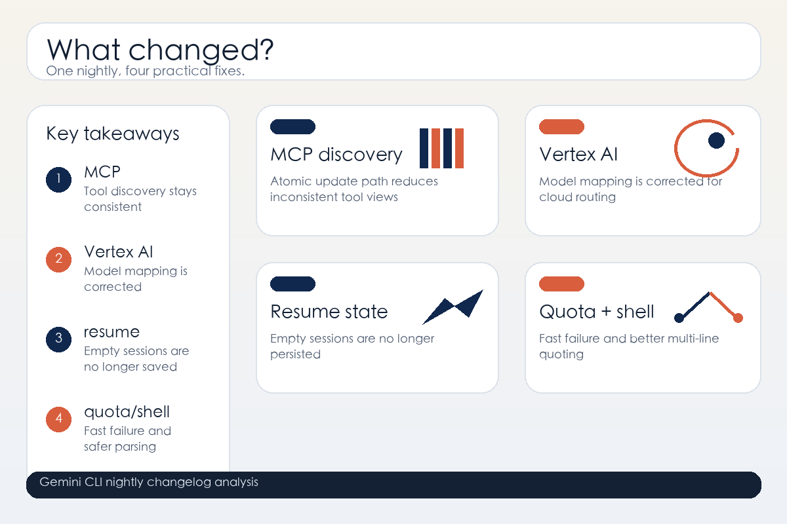

# Gemini CLI v0.48.0-nightly.20260613.g9e5599c32 Changelog Deep Analysis

> Release time: 2026-06-13 00:21:21Z
> Version under review: v0.48.0-nightly.20260613.g9e5599c32

---

## 1. TL;DR

The four most important things in this release:

1. MCP tool discovery now uses an atomic update path, which should make tool enumeration more stable.
2. Vertex AI model mapping has been fixed, so cloud model routing is less likely to drift.
3. Empty resume sessions are no longer persisted, which keeps history cleaner and recovery safer.
4. `zero-quota` failures now fail fast, and `stripShellWrapper` handles multi-line escaped quotes more reliably.

One line: **this nightly is mostly about stability, execution details, and fewer weird edge-case failures.**

## 2. What this release is really about

The release body is short, but the signal is clear. This is not a flashy feature drop. It is a maintenance update that tightens the runtime and tooling edges:

- more careful MCP discovery
- more accurate Vertex AI mapping
- cleaner resume/session state
- clearer quota and shell parsing failure paths

If you plug Gemini CLI into automation, agent execution, or multi-model workflows, these details matter more than the headline.

## 3. The important changes

### 3.1 MCP tool discovery now updates atomically

`fix(core): implement atomic update in MCP tool discovery` is one of the most important low-level fixes in the release.

It is not only about “finding tools.” It is about avoiding inconsistent intermediate states while the tool list updates.

That usually means:

- fewer half-updated tool views during refreshes
- better behavior under concurrent queries or rapid switching
- a more accurate MCP tool surface for higher-level agents

For agent workflows, discovery is an entry point. If it wobbles, planning, calling, and fallback logic all inherit the instability.

### 3.2 Vertex AI model mapping was corrected

`Vertex ai model mapping fix` points to a correction in Gemini CLI's Vertex AI model routing.

These bugs are common and annoying: when name mapping, backend aliases, or provider semantics drift, users think they are calling one model while requests actually reach another.

The practical upside is:

- more predictable cloud routing
- fewer misdirected requests in Vertex AI scripts
- less ambiguity when diagnosing model-selection problems

If your automation depends on a stable relationship between model names and providers, this is worth validating first.

### 3.3 Antigravity CLI docs and migration commands were added

`Add documentation and migration commands for Antigravity CLI` is not just copy work. It usually means the project is providing an explicit migration path for an older or newer entry point.

Why that matters:

- users get a clearer upgrade path
- command/config migration does not rely on guesswork
- switching tools becomes less painful

CLI migration docs matter because people only migrate when the path is obvious.

### 3.4 Empty resume sessions are no longer persisted

`Avoid persisting empty resume sessions` is a practical cleanup fix.

If empty resume sessions get written to state, you end up with:

- noisy recovery lists
- meaningless session entries in the UI or CLI
- more chances for recovery logic to make the wrong assumption

By blocking that write path, resume state stays cleaner and recovery behavior is easier to trust.

### 3.5 `zero-quota` now fails fast instead of hanging retries

`Ensure zero-quota limits fail fast to prevent retry loop hang` is another high-value stability fix.

It fixes a nasty failure mode: when quota is already exhausted, the system should not keep retrying until the whole call chain stalls.

The benefits are straightforward:

- failures surface sooner
- automation does not get stuck in pointless retries
- upstream systems can alert or degrade correctly

For batch jobs, daemon loops, and agent loops, that matters more than “one more retry.”

### 3.6 `stripShellWrapper` handles multi-line escaped quotes better

`handle multi-line escaped quotes in stripShellWrapper` is a classic shell-edge fix.

Multi-line commands, nested quotes, and escaped backslashes are exactly the kind of combination that makes wrapper parsing go wrong.

After the fix, these cases should be more reliable:

- multi-line Bash or shell snippets
- command strings with escaped quotes
- inputs that are wrapped and then parsed again

Those bugs usually show up only in real workflows, which is why fixing them pays off.

### 3.7 Tool output formatting is being standardized

`refactor(core): standardize tool output formatting` suggests Gemini CLI is tightening its output contract.

For humans, consistent formatting is easier to read. For agents, it is even more important because it means:

- easier parsing
- easier assertions
- easier reuse across tools

This kind of change rarely looks dramatic, but it has a big effect on composability.

## 4. Risk assessment

This release is mostly about stability work, so it is not the kind of update that screams “breaking change.”

Still, three areas are worth checking:

| Risk | Note |
|---|---|
| MCP discovery behavior | If you depend on discovery ordering or intermediate states, test concurrency paths |
| Vertex AI mapping | Scripts using Vertex AI should confirm model names are not being rewritten unexpectedly |
| Shell parsing edges | Re-run minimal tests for multi-line commands and complex quoting |

## 5. Upgrade advice

You should try this nightly sooner if you:

1. Depend on MCP discovery or dynamic tool lists.
2. Use Vertex AI and care about stable model routing.
3. Have automated resume or session-recovery flows.
4. Run agent loops, batch jobs, or shell-heavy automation.

If you only use Gemini CLI manually from time to time, you can observe first, but the overall direction here is still worth following.

## 6. Conclusion

Gemini CLI v0.48.0-nightly.20260613.g9e5599c32 is not trying to impress with a new surface area.

It is answering three practical questions:

- Can tool discovery be more stable?
- Can cloud model mapping be more accurate?
- Can failure paths exit faster and cleaner?

The answer is trending toward yes. For CLI and agent users, that kind of nightly is often more valuable than a flashy feature drop.

*Source: GitHub release and compare diff*
