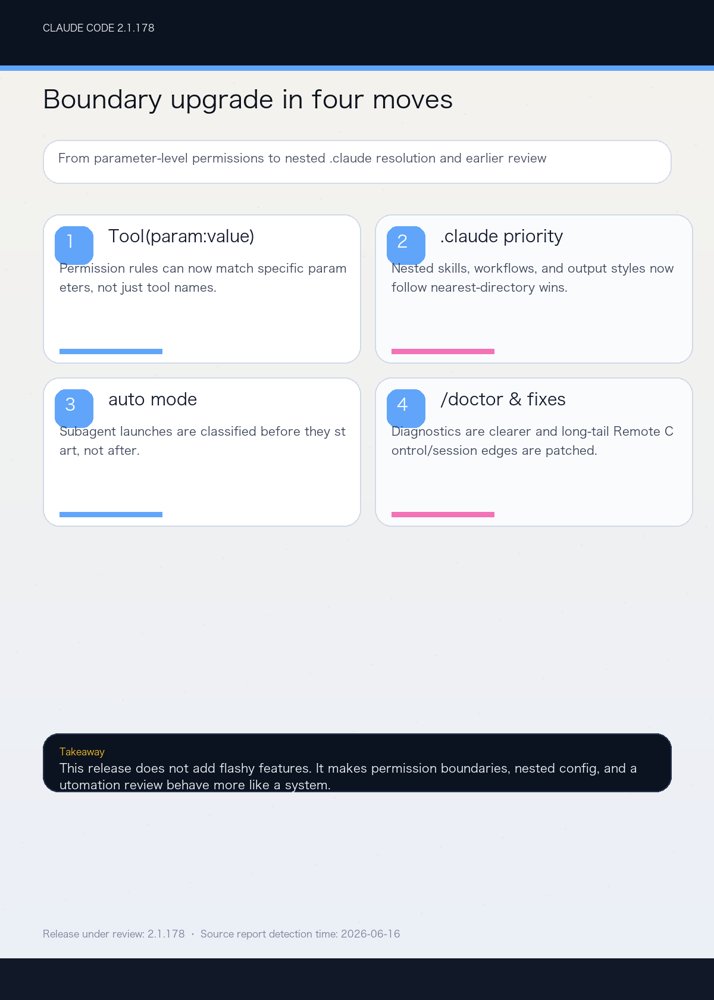

# Claude Code 2.1.178 Changelog Deep Analysis

> Published from the source report detection time: 2026-06-16
> Release under review: 2.1.178

---

## 1. TL;DR

The six most important things in this release:

1. Permission rules now support `Tool(param:value)` matching, which means input parameters can finally be part of the policy surface, with `*` wildcards supported too.
2. Nested `.claude/skills` directories now load when you are working inside them, and name clashes are kept side by side as `<dir>:<name>`.
3. Nested `.claude/` resolution now follows proximity: the agent, workflow, and output-style closest to the working directory wins, and project-scope workflow saves target the nearest existing `.claude/workflows/`.
4. auto mode now runs subagent launches through the classifier before they actually start, closing a gap where a subagent could request a blocked action without review.
5. `/doctor` is clearer, skill truncation warnings now say how many descriptions are affected, and `/bug` now requires a description before submission.
6. A long tail of real-world edge cases got fixed: remote control, stale websocket/OAuth file descriptors, background sessions, `claude agents`, vim undo, and CJK IME behavior all got steadier.

One line: **2.1.178 is a maintenance release focused on permission expressiveness, nested config resolution, and automated safety boundaries.**

## 2. What this release is really about

Claude Code 2.1.178 does not chase spectacle. It keeps tightening the places that tend to fail in long-running environments:

- permission rule expression
- nested `.claude` priority
- auto mode subagent review
- diagnostics and warning clarity
- remote control and session recovery

If you wire Claude Code into OpenClaw, a monorepo, or unattended automation, this release matters more than a typical bugfix.

## 3. The important changes

### 3.1 Permission rules can now match parameters, not just tool names

The standout new capability is `Tool(param:value)`.

Before this release, many permission rules were coarse. Now you can match on the tool input itself, for example:

```text
Agent(model:opus)
```

That means policy can be far more precise. Instead of allowing or blocking a whole tool, you can constrain a specific model, a specific parameter, or a wildcarded combination. For teams that need to control subagent models, connection targets, or other risky actions, this feels much closer to a real policy language.

### 3.2 Nested `.claude/skills` and `.claude/` now behave the way people expect

This version makes locality explicit.

When you work inside a subdirectory, nested `.claude/skills` now load there too. If a skill name collides, the nested version appears as `<dir>:<name>`, so both the root skill and the local skill stay available.

The same idea now applies to agents, workflows, and output styles inside `.claude/`: the closest directory to your working location wins. Project-scope workflow saves also target the nearest existing `.claude/workflows/`.

That matters a lot in monorepos. You no longer have to guess which layer won; the resolution model now looks much closer to the filesystem itself.

### 3.3 auto mode now inserts review before launch

One of the classic worries in unattended automation is that the subagent is already starting before the system realizes it should not have been allowed.

2.1.178 moves that check earlier. auto mode now sends subagent launches through the classifier before launch, which closes a safety gap. The key point is not simply that things are “stricter,” but that review happens sooner.

For unattended workflows, that is a meaningful control improvement. It reduces the chance of “execute first, explain later” behavior and makes the policy boundary feel real.

### 3.4 Diagnostics and visibility are much more usable

Several small-but-annoying visibility problems were cleaned up together:

- `/doctor` now renders as a more consistent flat tree
- section status icons are clearer
- command names stand out more
- skill truncation warnings now include the number of affected descriptions
- the workflow prompt keyword uses a purple shimmer and only triggers on explicit phrases
- `/bug` now requires a description before submission, and it no longer uses model-refusal text as the GitHub issue title

Each change is minor on its own, but together they reduce the gap between what you see and what the system is actually doing.

### 3.5 Remote control, background sessions, and long-tail edge cases got patched

The fix list is long, but it is all very “real world”:

- Remote Control errors are more specific, and connection failures now show a persistent red `/rc failed` indicator
- “not yet enabled” errors now explain whether the failure is gate-related, a check failure, stale entitlement, or org policy
- stale websocket / OAuth file descriptor crashes are fixed
- Claude in Chrome no longer silently fails when the token belongs to a different account
- `claude agents` worker 401 bearer-token failures are fixed
- background sessions created with `/bg` or `←←` no longer get stuck at “Working”
- model requests no longer keep failing after credentials are refreshed outside the session
- vim mode `u` now undoes one command at a time instead of collapsing quick successions
- pressing Esc to dismiss a CJK IME candidate window no longer cancels the running Claude task

These are not flashy features. They are the kind of fixes that decide whether a CLI feels production-grade in messy environments.

## 4. My take on the upgrade

If you only use Claude Code occasionally, this release may not feel dramatic.

If you rely on any of these, though, 2.1.178 is worth following:

- parameter-level permission control
- nested `.claude` workflows and skills
- auto mode or subagent automation
- clear `/doctor`, `/bug`, and skill visibility
- remote control, background sessions, tmux/SSH, or mixed-platform workflows

The important signal here is not “what was added,” but “what now behaves more like a boundary.”

## 5. Before and after upgrading

Before upgrading:

- check whether your permission rules depend on coarse tool names
- confirm whether nested `.claude/skills` and `.claude/workflows` have name collisions
- make sure you are not treating auto mode review as a thing that happens after launch

After upgrading:

- run `/doctor` in your key directories
- verify that rules like `Agent(model:opus)` behave as expected
- test nested skill and workflow resolution order
- send one subagent through the full review path and confirm the classifier intercept point

## 6. Conclusion

Claude Code 2.1.178 is not a flashy release, but it is a serious maintenance upgrade.

It pushes the system toward cleaner boundaries:

- permission rules are more precise
- nested config is more predictable
- auto mode is safer
- diagnostics are clearer
- remote control and background sessions are less surprising

If Claude Code is already part of your daily workflow, this is a good version to keep pace with.
