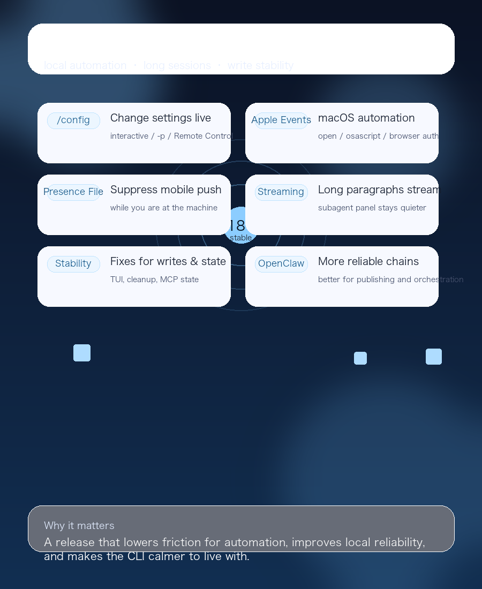

# Claude Code 2.1.181 Changelog Deep Analysis

> Published from the source report detection time: 2026-06-18
> Release under review: 2.1.181

---

## 1. TL;DR

The six most important things in this release:

1. `/config key=value` is new, so any setting can now be changed directly from the prompt in interactive mode, `-p`, and Remote Control.
2. macOS automation got a useful missing piece: `sandbox.allowAppleEvents` is now opt-in, and `open`, `osascript`, and browser auth flows no longer trip over Apple Events error `-600`.
3. `CLAUDE_CLIENT_PRESENCE_FILE` lets you suppress mobile push notifications while you are already at the machine.
4. The bundled Bun runtime is now 1.4, long paragraphs stream line by line, and the subagent panel is much quieter.
5. A long list of stability issues was fixed: prompt caching, network-drive and cloud-synced writes, startup stalls, corrupted config, macOS TUI freezes, transcript cleanup, runaway nested subagents, AWS credential refresh, and MCP connection-state bugs.
6. Interaction polish improved too: `/recap`, `/stats`, AskUserQuestion, copy/paste, retry indicators, and a few other rough edges are all a bit cleaner.

One line: **2.1.181 is a maintenance release centered on local automation, long-session stability, and interaction cleanup.**

## 2. What this release is really about

Claude Code 2.1.181 is not trying to ship the flashiest headline feature. It keeps tightening the places that usually break in real workflows:

- runtime config changes
- macOS automation and browser auth
- push-notification noise control
- long-form streaming and subagent UI
- network-drive writes and session recovery

If you wire Claude Code into OpenClaw, remote Macs, automation scripts, or multi-session workflows, this release is more valuable than it may first appear.

## 3. The important changes

### 3.1 `/config key=value` makes in-session tuning first-class

The most direct new capability here is `/config key=value`.

In practice, you can now change any setting from an interactive session, `-p`, or Remote Control without jumping through a heavier config path. For example:

```text
/config thinking=false
```

That is a useful shift for temporary model tuning, sandbox changes, or team defaults. The important part is not just that the command exists, but that runtime config now feels like part of the prompt surface.

### 3.2 macOS automation finally gets the Apple Events piece

This release fills in a major macOS automation gap:

- `sandbox.allowAppleEvents` is now opt-in
- `open` failures are fixed
- `osascript` failures are fixed
- browser auth flows no longer hit Apple Events error `-600`

If your workflow depends on the system browser, OAuth redirects, AppleScript, or local automation, this should mean far fewer mysterious failures. For heavy Mac users, this is a real reliability improvement.

### 3.3 Presence-based push suppression is now possible

`CLAUDE_CLIENT_PRESENCE_FILE` is tiny, but it matters.

You can point Claude Code at a marker file and use it to suppress mobile push notifications while you are already sitting at the machine. That is especially useful for:

- desktop-heavy daily development
- long-running agent / cron / heartbeat workflows
- reducing notification noise when you do not need cross-device alerts

The feature is not about turning notifications on. It is about knowing when not to send them.

### 3.4 Runtime and interaction polish are noticeably better

The release also makes the tool feel smoother:

- bundled Bun is now 1.4
- long paragraphs stream line by line instead of waiting for the first line break
- the subagent panel auto-hides after 30 seconds of idleness
- the list is capped at 5 rows and shows scroll hints
- keyboard hints in the footer are clearer

None of those are huge headline features on their own, but together they make the CLI feel less blocking and more like something you can keep open all day.

### 3.5 A lot of long-tail stability bugs were fixed at once

The real value in this release is the fix list:

- prompt caching on custom `ANTHROPIC_BASE_URL` and Foundry
- 0-byte or truncated writes on network drives and cloud-synced folders
- launch stalls and slow-network startup blocking
- startup crashes when `.claude.json` is corrupted
- macOS TUI freezing when Spotlight is busy
- 30-day transcript cleanup accidentally deleting long-lived history
- runaway nested subagents launched from the foreground
- model reuse issues after `/recap` or a model switch
- subagent thinking duration, waiting state, and retry indicator cleanup
- AWS `awsCredentialExport` refresh timing
- `claude mcp get/list` status handling when `tools/list` fails
- stale `connecting…` text in `/remote-control`

These are not flashy features. They are the kind of bugs that decide whether a CLI feels production-grade once you use it for real.

## 4. What this means for OpenClaw users

If you use Claude Code as the local execution engine, subagent orchestrator, or publishing tool inside OpenClaw, this release is especially relevant:

- `/config` makes mid-task tuning lighter
- `CLAUDE_CLIENT_PRESENCE_FILE` reduces desktop notification noise
- Apple Events and browser auth fixes improve success rates on macOS automation
- network-drive and cloud-sync write fixes are safer for synced repos, vaults, and workspaces
- subagent nesting, MCP state, and long-session history fixes reduce the chance of unattended jobs falling over

In other words: this release is less about being flashier and more about running longer.

## 5. Before and after upgrading

Before upgrading, check whether you depend on:

- older config-editing workflows
- macOS automation that uses `open`, `osascript`, or browser OAuth
- network drives, iCloud, Syncthing, or other sync targets
- long transcript history, subagent panels, or MCP status output for automation

After upgrading, it is worth smoke-testing:

- `/config thinking=false`
- one browser auth flow
- a minimal write into a synced directory
- one `mcp get/list` path
- one long-session recovery and one subagent path

## 6. Conclusion

Claude Code 2.1.181 is not a flashy release, but it does a lot of the work that makes a tool feel trustworthy.

It tightens the boundaries further:

- config changes are direct
- macOS automation is steadier
- notification control is more precise
- long output streams more smoothly
- writes and recovery behave more reliably

If Claude Code is already part of your day-to-day workflow, this is a good version to keep pace with.
