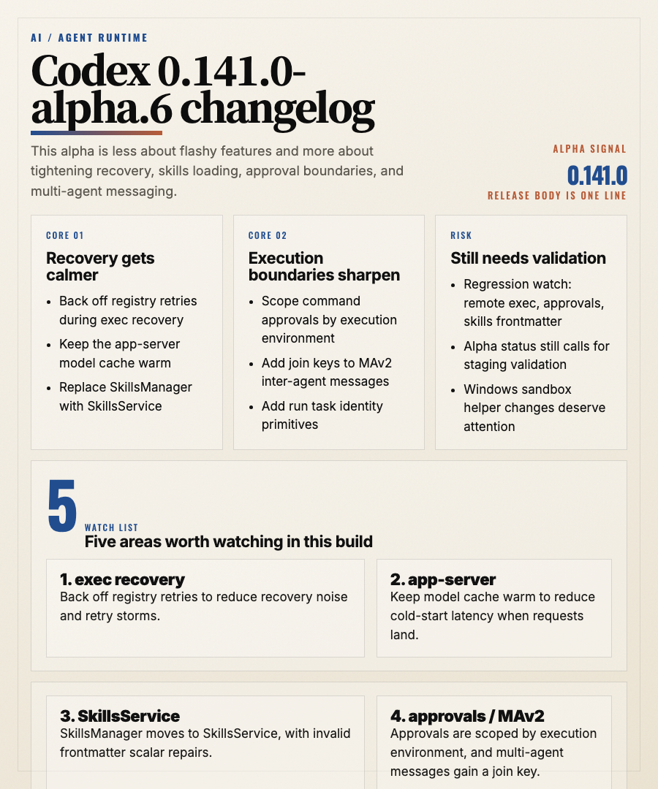

# Codex 0.141.0-alpha.6 Changelog Deep Analysis

> Published on: 2026-06-18
> Release under review: 0.141.0-alpha.6

---

## 1. TL;DR

The five most important things in this release:

1. exec recovery now backs off registry retries, which makes recovery less noisy.
2. app-server keeps the model cache warm, which can reduce cold-start delays in long-lived or remote setups.
3. SkillsManager has been replaced with SkillsService, and invalid skill frontmatter scalars are fixed.
4. command approvals are now scoped by execution environment, making permission boundaries more precise.
5. MAv2 inter-agent messages gain a join key, and run task identity primitives start filling in the identity layer.

One line: **0.141.0-alpha.6 feels more like a runtime, permission-boundary, and collaboration-protocol cleanup than a flashy feature release.**

## 2. What this release is really about

The official release body is only `Release 0.141.0-alpha.6`, so the real signal comes from the compare data and the linked commits.

This is not a release aimed at shipping a big new CLI feature. It is a pass over the core plumbing:

- exec recovery stops hammering the registry
- app-server keeps model cache warm
- skills move from manager semantics to service semantics
- approvals stop being broadly reused across environments
- multi-agent messaging and task identity start looking like a coherent protocol

If you only run short local commands, the impact may be subtle. If you depend on app-server, skills, custom approvals, multi-agent orchestration, or remote execution, the stability impact is immediate.

## 3. The important changes

### 3.1 exec recovery now backs off retries

`Back off registry retries during exec recovery (#28546)` is one of the clearest stability changes in this build.

The point is not “recover faster.” The point is “do not create a retry storm while recovering”:

- transient registry failures no longer trigger aggressive retries
- the recovery path generates less log noise
- long-running jobs, cron tasks, and automated agents get a calmer failure mode

That kind of change is small on paper and very important in practice.

### 3.2 app-server keeps the model cache warm

`app-server: keep the model cache warm (#28699)` means app-server is now more proactive about maintaining cached model data instead of waiting for a request to arrive and then refreshing on demand.

The practical upside is straightforward:

- model lists or capability data may be ready earlier
- first-open latency for model selection or config reads may go down
- deployment owners should watch for background refresh failures or rate-limit behavior

If you build on app-server, this is a good release to recheck refresh timing and cache invalidation behavior.

### 3.3 SkillsManager becomes SkillsService

`Replace SkillsManager with SkillsService (#28705)` is a major internal refactor in the skills system.

That usually means:

- skills loading becomes more service-like
- manager semantics are replaced by service semantics
- related tests, loaders, and error messages are being reshaped

This release also repairs `invalid skill frontmatter scalars`, which suggests the frontmatter parser is being hardened at the same time.

If you rely on custom skills, the key checks are:

- are skills still discovered correctly?
- are there any non-scalar frontmatter fields?
- are the error messages clearer than before?

### 3.4 command approvals are scoped by execution environment

`Scope command approvals by execution environment (#28738)` is the most important permission-boundary change in this release.

The implication is simple: approvals inside one Codex session should not be blindly reused across different execution environments.

That affects:

- local, remote, sandbox, and app-environment approvals
- automation flows that used to assume one approval covered everything
- user understanding of which execution context was actually approved

This is a security-positive change, but it may require adjustments in older automation setups.

### 3.5 multi-agent messaging and task identity are becoming first-class

`Add join key for MAv2 inter-agent messages (#28561)` and `feat: add run task identity primitives (#19047)` tell the same story: Codex is moving multi-agent collaboration from “works” toward “can be attributed, correlated, and audited.”

Why that matters:

- parent/child agents and threads are easier to associate
- logs become easier to attribute and debug
- the collaboration protocol starts to feel like durable infrastructure instead of ad hoc wiring

If you maintain your own orchestration tooling, this is the area to watch for message-envelope and protocol-field changes.

## 4. Risk and impact

### 4.1 Alpha risk still applies

This is a prerelease alpha, not a stable release. The official body is also extremely short, so treat it as a validation build rather than a production replacement.

### 4.2 approvals may become more frequent

Once approvals are scoped by execution environment, the old “approve once, reuse everywhere” pattern may stop working.

### 4.3 skills compatibility needs a retest

The SkillsService migration and frontmatter repair land together, which means the skills-loading boundary is moving. Custom or generated skills should be revalidated.

### 4.4 remote execution and app-server should be watched closely

Model cache warming, exec recovery backoff, multi-agent join keys, and run task identity are all low-level changes. A staging pass is recommended.

## 5. My take on the upgrade

This release is not trying to impress users with a big surface-area feature.

It does a few practical things well:

- makes recovery quieter
- makes app-server feel more like a long-lived service
- makes skills more service-like
- makes approvals more precise
- makes multi-agent state more traceable

That kind of release is valuable because it removes future friction instead of adding visible novelty.

## 6. Upgrade suggestions

1. If you are tracking the `0.141.0` alpha line, this is a good one to validate first.
2. If you depend on app-server, run model listing, config reads, and a refresh cycle.
3. If you use skills, audit frontmatter and loader errors.
4. If you automate approvals, confirm that execution environment is part of your policy.
5. If you orchestrate multiple agents, check whether join keys and task identity now appear in your logs.

## 7. Conclusion

Codex 0.141.0-alpha.6 is a classic “infrastructure cleanup” alpha.

It is not flashy, but it is directionally strong:

- exec recovery is steadier
- app-server stays warmer
- skills are more service-oriented
- approvals are narrower
- multi-agent messages are easier to correlate

If you care about execution stability, permission boundaries, and collaboration protocol quality in Codex, this version is worth tracking.
