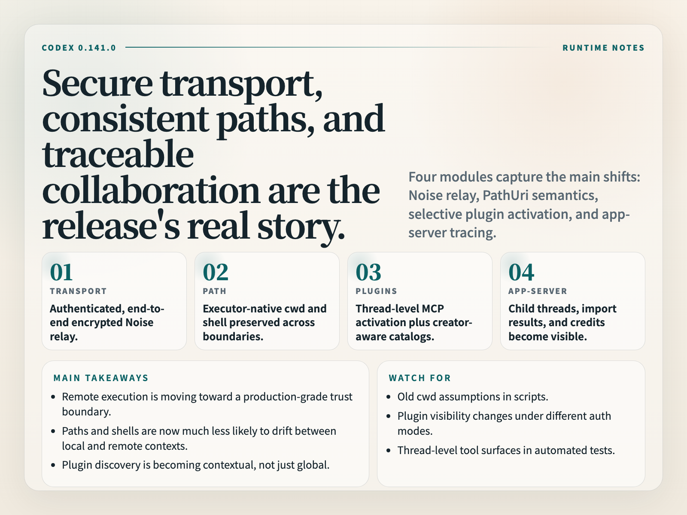

# Codex 0.141.0 Changelog Deep Analysis

> **Published**: 2026-06-18 04:43:06 UTC
> **Version**: `0.141.0`
> **Tag**: `rust-v0.141.0`
> **Release URL**: https://github.com/openai/codex/releases/tag/rust-v0.141.0
> **prerelease**: no
> **Release body**: `Release 0.141.0`

## 1. TL;DR

The five most important things in this release:

1. Remote executors now use authenticated, end-to-end encrypted Noise relay channels, which makes the transport boundary much harder.
2. Cross-platform remote execution now preserves executor-native cwd, shells, and permission paths, so execution semantics are more stable.
3. Selected executor plugins can activate stdio MCP servers per thread, and discovery adds a created-by-me marketplace plus auth-specific catalogs.
4. App-server can list child threads, correlate external-agent imports, and read rate-limit reset credits.
5. Realtime and TUI both gained finer control, which makes mixed human/agent workflows easier to operate.

One line: **0.141.0 is not telling a new story; it is making remote execution, plugin discovery, and interaction boundaries safer, steadier, and more controllable.**

## 2. What this release is really about

The release body is no longer the single-line alpha placeholder, but the overall shape is still strongly engineering-driven rather than a flashy end-user announcement.

The main thread is clear:

- remote executor transport is more secure
- cwd / shell / permission semantics are more consistent across platforms
- plugin and MCP exposure is more selective
- app-server and realtime are better suited to multi-threaded, multi-session, and mixed human/agent workflows

This is not a single feature drop. It is a cleanup pass around execution semantics and collaboration observability.

## 3. The important changes

### 3.1 Remote execution got a harder security boundary

`Remote executors now use authenticated, end-to-end encrypted Noise relay channels.` This is the strongest security signal in the release.

The key point is not just encryption:

- the channel is authenticated
- transport is end-to-end encrypted
- the relay layer is no longer just a loose middleman

For anyone running Codex on remote machines, sandboxes, or multi-environment execution layers, this moves the remote control path closer to a production-grade communication model rather than a temporary proxy chain.

### 3.2 Cross-platform cwd, shells, and permission paths are more consistent

`Cross-platform remote execution now preserves executor-native working directories and shells, including filesystem permission paths across app-server and exec-server boundaries.` Combined with the security change above, this is basically the release's runtime spine.

The practical problem it addresses is simple: when app-server, exec-server, local shells, and remote executors interact, path and shell semantics should not drift.

This usually matters most in places like:

- directories with spaces
- non-ASCII paths
- symlinked directories
- remote shells that do not match the local default shell
- permission paths crossing execution boundaries

If you use Codex on real workspaces, this is more important than another small command surface change.

### 3.3 Plugins and MCP are now exposed more contextually

`Selected executor plugins can activate their stdio MCP servers per thread; plugin discovery also adds a created-by-me marketplace and auth-specific curated catalogs.` This says the plugin ecosystem is moving from “visible” to “context-aware”.

The signals here are pretty clear:

- MCP is no longer just a global exposure; it can be activated per thread
- plugin discovery now considers the creator's view
- different auth modes see different catalogs

In short, Codex is turning the plugin system from a flat list into a controllable capability surface. That is better for governance, debugging, and auditability.

### 3.4 App-server is becoming a traceable collaboration hub

These items belong together:

- `App-server clients can list immediate child threads`
- `correlate external-agent imports with detailed results`
- `read or redeem rate-limit reset credits`

That means app-server is no longer just a request entry point. It is becoming a collaboration layer that can connect parent and child threads, external agent imports, and rate-limit recovery state.

That matters for team workflows, external-agent imports, and long-running sessions because the system can now explain more of its own context.

### 3.5 Realtime and TUI gained finer control

`Realtime clients` can explicitly append speech, control how Codex responses enter conversations, and omit startup context; `TUI input prompts` can auto-resolve after inactivity, with a countdown that pauses on interaction.

These sound like UX details, but they are very useful for automation and semi-automation:

- speech input is more controllable
- response entry behavior is more controllable
- startup context can be omitted when needed
- prompts no longer just idle forever; they can resolve after inactivity

The release is clearly trying to improve both machine control and human pacing.

## 4. Risk and impact

- The execution semantics have been reorganized, so scripts that depend on older cwd parsing or shell assumptions need a regression pass.
- Plugin discovery now splits by auth mode and creator view, so the old “everything is visible everywhere” assumption may no longer hold.
- Thread-level MCP activation changes the tool surface, so automated tests need to verify thread context carefully.
- App-server's child-thread and external-agent tracking is stronger now, which means logs should be checked with more attention to attribution.

## 5. My take on the upgrade

0.141.0 feels like a release that is cleaning up the foundation rather than showing off the furniture.

The most important value is in three things:

- remote execution is more secure
- execution semantics are more consistent
- plugins and collaboration are more traceable

If you think of Codex as an actual agent runtime rather than just a CLI wrapper, these changes are very real.

## 6. Upgrade suggestions

1. If you use remote executors, re-check authentication, cwd, shell, and permission paths first.
2. If you depend on plugins and MCP, verify thread-level activation and discovery results again.
3. If you use app-server for multi-thread collaboration, make sure child-thread and external-agent logs still connect cleanly.
4. If you rely on speech or TUI interactions, validate auto-resolve and response-entry behavior against your workflow.

## 7. Conclusion

The three keywords I would keep for Codex 0.141.0 are:

**secure, consistent, controllable.**

This release pushes remote execution, cross-platform path semantics, plugin discovery, and collaboration tracing forward. It is not the loudest release, but it feels like a move toward a more stable runtime.
