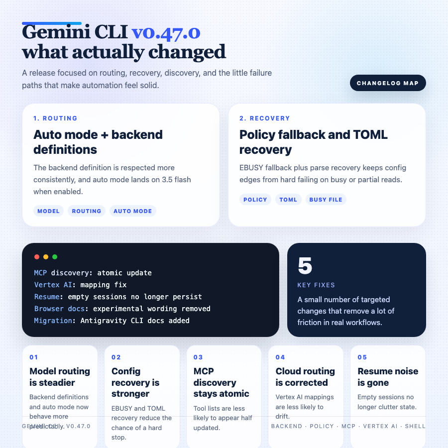

# Gemini CLI v0.47.0 Changelog Deep Analysis

> Release time: 2026-06-18 01:51:23 UTC  
> Version under review: v0.47.0

---

## 1. TL;DR

The five most important things in this release:

1. Gemini CLI now respects backend definitions more consistently, and auto mode will land on 3.5 flash when the flag is enabled.
2. `fix(policy)` adds both an `EBUSY` fallback and TOML parse recovery, which makes config and lock boundaries much less fragile.
3. MCP tool discovery now uses an atomic update path, avoiding half-updated tool states.
4. Vertex AI model mapping has been corrected, so cloud routing is less likely to drift.
5. Antigravity CLI docs and migration commands are now in place, making transitions from older flows much easier.

One line: **v0.47.0 is mostly about tightening the boundaries that actually affect automation and agent workflows.**

## 2. What this release is really about

The release body is short, but the signal is clear. This is not a flashy feature drop. It is a maintenance update that hardens the execution and configuration paths.

The pattern is consistent:

- backend/model selection is being narrowed down
- policy / TOML / file-lock edges are being repaired
- MCP discovery is being made atomic
- Vertex AI mapping is being corrected
- resume/session state is being cleaned up
- shell and browser-agent docs are being de-noised

If you wire Gemini CLI into automation, agent loops, MCP tooling, or unstable environments, this release matters more than the headline suggests.

## 3. The important changes

### 3.1 backend definitions and auto mode now line up more clearly

`Respect backend definitions for 3.5 flash and Update auto mode to use 3.5 flash when the flag is enabled.` is one of the most visible behavior changes in this release.

The important part is not just “the default model changed.” It is that Gemini CLI now seems to honor backend definitions more strictly.

Practically, that means:

- if you define a backend in config, runtime behavior is less likely to override it
- auto mode becomes more predictable when the flag is enabled
- scripts and agents are easier to reproduce across runs

For people who switch models or backends often, that saves a lot of “why did it behave differently today?” debugging.

### 3.2 `fix(policy)` covers `EBUSY` and TOML recovery

`fix(policy): add EBUSY fallback and TOML parse recovery` is a classic stability fix.

It covers two annoying edge cases:

- `EBUSY`, which usually means a file or resource is temporarily busy
- TOML parse recovery, which implies a config file may be broken or partially read

The benefits are straightforward:

- temporary file contention is less likely to hard-fail
- broken TOML configs have a clearer recovery path
- automation is less likely to die on one bad state transition

For a CLI tool, config loading is the first hop. If that hop is fragile, everything downstream suffers.

### 3.3 MCP tool discovery now updates atomically

`fix(core): implement atomic update in MCP tool discovery` is another important low-level fix.

This is not just about whether tools can be found. It is about whether a refresh can expose a half-finished state.

That usually means:

- fewer wobbling tool lists during refresh
- more consistent tool views under concurrency or rapid switching
- fewer bad decisions from upstream agents due to transient inconsistency

If you rely on MCP for dynamic orchestration, this kind of fix is often more useful than adding a new tool.

### 3.4 Vertex AI model mapping was corrected

`Vertex ai model mapping fix` points to a correction in Gemini CLI's Vertex AI routing.

These bugs are annoying because the mapping can look right while requests are actually landing on a different alias or provider.

The practical upside is:

- cloud routing becomes more predictable
- Vertex AI scripts are less likely to misfire
- there is less ambiguity between model names, providers, and actual requests

If you are on mixed cloud, enterprise, or multi-backend setups, this is worth validating first.

### 3.5 Antigravity CLI docs and migration commands were added

`Add documentation and migration commands for Antigravity CLI` sounds like documentation work, but it usually means the project is providing an explicit migration path.

That matters because:

- users do not have to guess how to migrate
- command/config changes are easier to adopt
- the relationship between old and new flows becomes clearer

For CLI tools, good migration guidance is often the difference between “the feature exists” and “people actually move.”

### 3.6 browser-agent docs no longer call it experimental

`chore: remove experimental text from browser agent docs` is a tiny change that still says a lot.

It usually means:

- the capability should no longer be framed as a trial balloon
- the docs are being aligned with a more stable mental model
- user expectations around browser agent behavior become clearer

In CLI ecosystems, docs are often the boundary line for behavioral promises.

### 3.7 Empty resume sessions are no longer persisted

`Avoid persisting empty resume sessions` is a practical cleanup fix.

Empty sessions in state files cause noise:

- recovery lists get polluted with false entries
- auto-recovery logic is easier to confuse
- diagnosis becomes harder because valid state and junk state blur together

Blocking that write path keeps resume behavior cleaner and easier to trust over long-running workflows.

## 4. Risk assessment

This release does not read like a breaking change release, but three areas still deserve attention:

| Risk | Note |
|---|---|
| auto mode / backend | If you depend on specific backend selection behavior, re-check the 3.5 flash routing |
| policy / TOML | Re-run tests around broken configs, file locks, and recovery paths |
| MCP discovery | Smoke-test dynamic tool lists and concurrent refreshes |

## 5. Upgrade advice

You should try this release sooner if you:

1. Use Gemini CLI auto mode or custom backend definitions.
2. Depend on policy files, config migration, or recovery logic.
3. Wire Gemini CLI into MCP toolchains or agent loops.
4. Run on Vertex AI and care about stable routing.
5. Use shell wrappers, browser-agent flows, or long-session resume.

If you only use Gemini CLI occasionally, this release is still not aggressive, but I would still run at least one minimal smoke test.

## 6. Conclusion

Gemini CLI v0.47.0 is not trying to win attention with a big feature.

It is answering a few practical questions:

- can backend definitions be trusted more?
- can config corruption recover more gracefully?
- can MCP discovery stay consistent?
- can cloud model mapping be more accurate?

All of those answers are moving toward “yes.” For CLI and agent users, that kind of stability work is often more valuable than a flashy feature drop.

*Source: GitHub release and compare diff*
