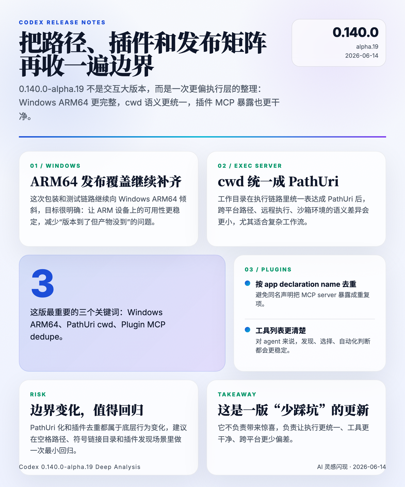

# Codex 0.140.0-alpha.19 Changelog 深度分析

> 发布日期：2026-06-14（北京时间抓取）
> 覆盖版本：0.140.0-alpha.19

---

## 一、TL;DR

这版最值得看 3 件事：

1. Windows ARM64 的发布覆盖继续增强，说明 Codex 的 Windows 分发矩阵还在补齐。
2. exec-server 把 cwd 改成 PathUri 传递，底层执行协议对跨平台路径和远程场景更统一了。
3. 插件 MCP 开始按 app declaration name 去重，插件发现和工具列表会更干净。

一句话：**0.140.0-alpha.19 是一版偏底层、偏执行链路的稳定性修复版。**

## 二、版本定位

这次 release body 很简短，官方没有额外手写长变更说明，所以核心判断主要来自 GitHub compare 和相关提交。

它不是那种面向终端用户的“大功能版本”，更像是一次把运行时边界收紧的维护更新：

- Windows ARM64 分发更完整
- exec-server 的 cwd 语义更统一
- 插件与 MCP 的去重逻辑更稳定

如果你把 Codex 当作 CLI 工具，这版未必立刻显著，但如果你在 Windows、远程执行、插件生态里重度使用它，这类底层修复会直接影响稳定性。

## 三、最重要的几处变化

### 3.1 Windows ARM64 发布覆盖增强

提交 `[codex] package Windows ARM64 on x64 (#28001)` 说明这版继续补 Windows ARM64 的发布链路。

它的意义很直接：

- Windows on ARM 设备的二进制可用性更强
- x64 构建链路对 ARM64 产物的包装和测试更稳
- 后续 Windows 用户遇到“有版本但没产物”的概率会降低

这类改动虽然不显眼，但它属于发布工程里最容易决定“能不能用”的部分。

### 3.2 exec-server 的 cwd 改成 PathUri

提交 `[codex] Carry exec-server cwd as PathUri (#28032)` 把工作目录在执行链路里统一成 PathUri。

这通常意味着几件事：

- 路径表示更适合跨平台传递
- 远程 exec-server 和本地 shell 的 cwd 语义更一致
- Windows 路径、空格路径、符号链接路径的歧义更少

结合上一版里 sandboxing 的 cwd PathUri 化，可以看出 Codex 正在把路径这件“看起来简单，实际最容易乱”的事系统化。

对 alpha 用户来说，最值得重点验证的是：

- 带空格的目录
- 非 ASCII 路径
- 符号链接目录
- 远程或沙箱环境下的 cwd 切换

### 3.3 插件 MCP 按 app declaration name 去重

提交 `[codex] Dedupe plugin MCPs by app declaration name (#27607)` 是这版很关键的插件侧变化。

它的目标大概率是避免同一个应用声明在插件加载后重复暴露 MCP server，减少：

- 重复工具
- 重复 server
- 重复安装建议
- 同名声明互相覆盖的不确定性

这对依赖插件发现的 agent 用户很重要，因为工具列表一旦重复，实际可观测性和自动化判断都会变差。

去重之后，插件生态会更像“一个声明对应一个入口”，边界也更清楚。

## 四、风险和影响

这版最大的风险不是功能冲突，而是底层行为变化：

- PathUri 化可能影响原先依赖旧 cwd 表达的脚本
- 插件 MCP 去重可能改变重复声明下的可见性
- Windows ARM64 发布变化需要在目标设备上重新验证产物

如果你只是普通 CLI 用户，影响可能不大。
但如果你在做多平台、远程执行、插件自动发现，还是值得尽快回归一遍。

## 五、我怎么看这次升级

0.140.0-alpha.19 没有那种让人眼前一亮的新交互，但它做的是很正经的基础工作：

- 让路径更统一
- 让插件更干净
- 让 Windows ARM64 的发布更完整

这类 release 的价值不在“新鲜”，而在“少踩坑”。

## 六、升级建议

1. Windows 用户，尤其是 ARM64 设备，建议优先验证这版。
2. 如果你依赖 exec-server、远程 cwd 或沙箱执行，先在 staging 跑最小用例。
3. 使用插件生态的 agent，升级后重新检查一次 MCP server 列表，确认没有重复项。

## 七、结论

Codex 0.140.0-alpha.19 更像一次底层执行链路的整理。

它不炫，但很实用：

- Windows ARM64 分发更成熟
- cwd 的 PathUri 表达更统一
- 插件 MCP 去重让工具暴露更清晰

如果你关心 Codex 的稳定性和跨平台执行体验，这版值得跟进。
