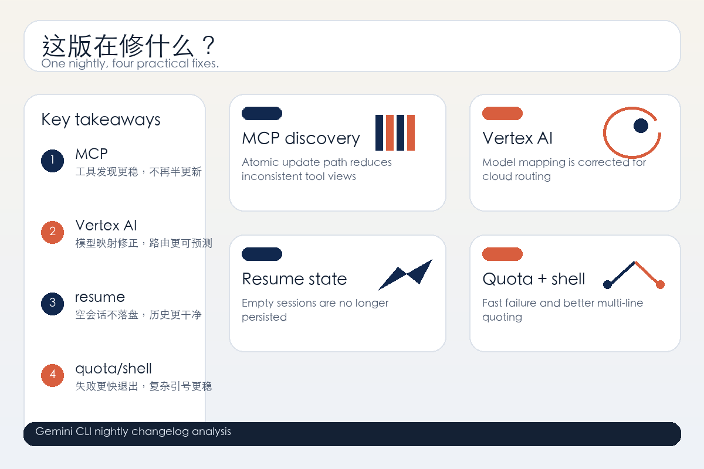

# Gemini CLI v0.48.0-nightly.20260613.g9e5599c32 Changelog 深度分析

> 发布时间：2026-06-13 00:21:21Z
> 覆盖版本：v0.48.0-nightly.20260613.g9e5599c32

---

## 一、TL;DR

这版最值得看 4 件事：

1. MCP tool discovery 增加原子化更新，说明工具发现链路正在往更稳的方向收口。
2. Vertex AI model mapping 修复，云端模型路由更不容易出错。
3. 空 resume sessions 不再被持久化，历史状态污染和误恢复风险更低。
4. `zero-quota` 失败会快速退出，shell wrapper 对多行转义引号的处理也更可靠。

一句话：**这是一版偏稳定性和执行细节的 nightly，重点在修边界，不在堆新概念。**

## 二、版本定位

这次 release body 不长，但信息很集中：它不是面向终端用户的“大功能版本”，更像是一次把 CLI 运行时和工具链底层补牢的维护更新。

你会看到几条很典型的信号：

- MCP 工具发现更谨慎
- Vertex AI 映射更准确
- resume/session 状态更干净
- quota 和 shell parsing 的失败路径更明确

如果你把 Gemini CLI 接进自动化、代理执行或多模型工作流，这类改动比表面上的功能名更重要。

## 三、最重要的几处变化

### 3.1 MCP tool discovery 开始走原子更新

`fix(core): implement atomic update in MCP tool discovery` 是本版最值得关注的底层修复之一。

它解决的不是“能不能找到工具”，而是“工具发现状态在更新过程中会不会短暂不一致”。

这类修复通常意味着：

- 工具列表刷新时不容易出现半更新状态
- 并发查询或快速切换场景更稳
- 上层 agent 看到的 MCP 工具视图更接近真实状态

对 agent 工作流来说，工具发现是入口层。一旦这里抖动，后面的规划、调用和回退都会一起受影响。

### 3.2 Vertex AI model mapping 修好了

`Vertex ai model mapping fix` 说明 Gemini CLI 在 Vertex AI 相关模型映射上做了纠偏。

这类问题常见但很烦：名称映射、后端别名、provider 语义一旦偏了，用户看起来像是在调用“同一个模型”，实际发出去的请求却不是。

修复的价值主要体现在：

- 云端模型路由更可预测
- 依赖 Vertex AI 的脚本更不容易误打到错误模型
- 诊断问题时更少出现“命名对了但调用错了”的歧义

如果你的自动化依赖模型名和 provider 的稳定对应关系，这条值得优先验证。

### 3.3 Antigravity CLI 的文档和迁移命令补上了

`Add documentation and migration commands for Antigravity CLI` 不是纯文案工作，它通常意味着项目已经开始为某个旧入口或新入口提供迁移路径。

它对用户的意义很直接：

- 有了更清晰的迁移说明
- 配置或命令迁移不必完全靠猜
- 生态层面的工具切换成本更低

这类改动看似“软”，但对 CLI 工具很关键。迁移命令写得好，才会有人真的迁。

### 3.4 空 resume sessions 不再落盘

`Avoid persisting empty resume sessions` 是一个很实用的清理型修复。

空 resume session 如果被写进状态文件，后面会带来几种常见问题：

- 恢复列表被噪声污染
- UI/CLI 里出现没意义的 session 条目
- 自动恢复逻辑更容易误判

现在这个问题被拦住后，resume 状态会更干净，后续恢复行为也更符合预期。

### 3.5 `zero-quota` 失败快速退出，避免 retry loop 卡死

`Ensure zero-quota limits fail fast to prevent retry loop hang` 是这版里另一个很重要的稳定性修复。

它解决的是一种很讨厌的失败模式：明明已经没有额度了，但系统还在 retry，最后把整个调用链拖住。

修复后的好处很明确：

- 失败会更早暴露
- 自动化不会在无意义的重试里挂死
- 上层更容易做正确的降级或告警

对于跑批处理、守护进程或 agent loop 的场景，这比“再试一次”重要得多。

### 3.6 `stripShellWrapper` 对多行转义引号更稳

`handle multi-line escaped quotes in stripShellWrapper` 是一个很典型的 shell 边界修复。

多行命令、嵌套引号、转义反斜杠，这些组合一旦处理不好，CLI 就会把真正的命令和包装层搞混。

修复之后，至少这几类场景会更可靠：

- 多行 Bash / shell 片段
- 含转义引号的命令串
- 由 wrapper 包裹后再解析的输入

这类 bug 经常只在真实工作流里出现，所以修掉的价值很高。

### 3.7 工具输出格式开始标准化

`refactor(core): standardize tool output formatting` 说明 Gemini CLI 在输出约定上继续收口。

对人类用户来说，格式统一能减少阅读成本；对 agent 来说，格式统一更重要，因为它意味着：

- 更容易解析
- 更容易断言
- 更容易在不同工具之间复用处理逻辑

这个变化通常不会直接“显眼”，但它会影响整个工具链的可组合性。

## 四、风险评估

这版主要是稳定性修补，不像某些 release 那样带来明显的破坏性改动。

但还是建议重点关注三类风险：

| 风险 | 说明 |
|---|---|
| MCP discovery 变化 | 如果你依赖工具发现顺序或中间态，需要回归并发场景 |
| Vertex AI 映射 | 使用 Vertex AI 的脚本要确认模型名没有被意外改写 |
| Shell 解析边界 | 多行命令和复杂引号场景最好重新跑一遍最小用例 |

## 五、升级建议

如果你符合下面任意一种情况，这版值得尽快试：

1. 你在用 MCP 工具发现或依赖动态工具列表。
2. 你在 Vertex AI 上跑模型，且依赖稳定映射。
3. 你有自动 resume / session 恢复逻辑。
4. 你跑的是 agent loop、批处理或自动化 shell 工作流。

如果只是偶尔手动用一下 Gemini CLI，可以先观察，但这版整体倾向还是“值得跟”。

## 六、结论

Gemini CLI v0.48.0-nightly.20260613.g9e5599c32 不是一版靠新功能吸引眼球的 release。

它更像在回答三个问题：

- 工具发现能不能更稳？
- 云模型映射能不能更准？
- 失败路径能不能更快、更干净地退出？

答案都在往“是”走。对于 CLI 和 agent 用户来说，这种 nightly 往往比花哨功能更值钱。

*来源：GitHub Release 与 compare diff*
