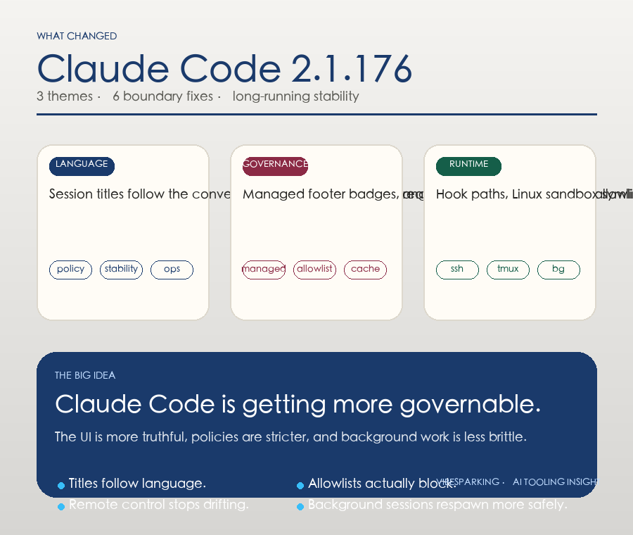

# Claude Code 2.1.176 Changelog 深度分析

> 发布日期：2026-06-13（源报告检测时间）
> 覆盖版本：2.1.176

---

## 一、TL;DR

这版最值得看 6 件事：

1. 会话标题会根据当前对话语言生成，`language` setting 可以把标题语言固定住。
2. 新增 `footerLinksRegexes`，managed settings 现在可以把 footer row 的正则徽章统一纳管。
3. `awsCredentialExport` 产出的 Bedrock 凭证改为按真实 `Expiration` 缓存，不再硬卡 1 小时。
4. `availableModels` 的 allowlist 真的开始收口了，alias 不能再借 `ANTHROPIC_DEFAULT_*_MODEL` 绕到被禁模型，`/fast` 也不会越界切换。
5. Read/Edit/Write 的 hook 路径匹配修好了，`Edit(src/**)`、`Read(~/.ssh/**)`、`Read(.env)` 这类规则终于按文档生效；Linux sandbox 的符号链接场景也补上了。
6. Remote Control、`/cd`、worktree、tmux/SSH 复制、后台会话、Windows daemon 和 auth recovery 都在继续补边界。

一句话：**2.1.176 是一版明显偏企业治理、远程接管和长期稳定性的维护版。**

## 二、版本定位

Claude Code 2.1.176 没有往“炫技”方向走，而是把长期运行时最容易出问题的地方继续收紧：

- 会话标题和语言体验
- 企业配置与 managed settings
- 模型 allowlist 和 fallback
- hook 路径匹配和 sandbox 边界
- Remote Control 与后台会话恢复
- Windows / Linux / tmux / SSH 这些现实环境里的脆弱点

如果你把 Claude Code 当日常 CLI，用这版会感觉更稳；如果你把它接进 OpenClaw、远程工作流或企业治理链路，这版的价值会更明显。

## 三、最重要的几处变化

### 3.1 会话标题终于会“说同一种语言”了

以前很多工具都会遇到一个老问题：正文是中文，标题却还是英文；或者标题风格跟当前对话语言不一致，列表里扫起来很别扭。

2.1.176 直接把 session title 的生成语言和当前对话语言对齐了。你也可以通过 `language` setting 把标题语言固定下来，避免自动切换带来的混乱。

这对两个场景特别有用：

- 中文工作流里，session 列表更容易扫读
- 多语言团队里，标题不会突然在中英之间跳来跳去

别小看这个改动。对长期高频使用者来说，标题一致性就是可检索性。

### 3.2 `footerLinksRegexes` 让 footer 徽章能被统一管理

这版新增了 `footerLinksRegexes`，允许用户设置或 managed settings 通过正则去识别 footer row 里的 link badges。

它的意义不是“多了一个字段”，而是企业团队终于有了更一致的脚手架：

- PR、issue、内部系统链接可以被统一识别成底部徽章
- managed settings 可以集中下发，减少每个工作区各配各的
- 正则规则可控，避免 footer 变成一堆互相污染的噪声

对治理来说，这个改动很像把“看起来像链接”变成“可以被规则系统稳定识别的链接”。

### 3.3 Bedrock 凭证缓存更贴近真实过期时间

以前来自 `awsCredentialExport` 的 Bedrock credentials 可能会按固定 1 小时缓存。2.1.176 改成直接尊重凭证自己的 `Expiration`。

这个修复很实在：

- 长任务更不容易因为缓存窗口假设错误而中断
- 短期凭证不会被错误延用
- 凭证轮换链路更接近真实 AWS 行为

对 Bedrock 用户来说，这属于“你不一定天天注意到，但出一次问题就很烦”的那类修复。

### 3.4 模型 allowlist 这次是真的开始生效了

这是本版最值得企业团队关注的一组改动。

2.1.176 修复了 `availableModels` enforcement 的几个绕路点：

- alias 模型选择不能再通过 `ANTHROPIC_DEFAULT_*_MODEL` 被重定向到 blocked model
- `/fast` 在会切换到 allowlist 外模型时会直接拒绝
- 没有启用 Opus 4.8 的组织，auto mode 会回退到当前可用的最佳 Opus 模型，而不是硬撞不可用目标

这类修复的本质很简单：**配置说不行，就真的不行。**

对个人用户这可能只是“少了一条捷径”，但对企业和多团队环境来说，这是模型治理从“文档层面存在”走向“运行时真正执行”。

### 3.5 hook 路径匹配和 Linux sandbox 边界补齐了

这版修了 Read/Edit/Write tool path 的 hook `if` 条件，文档里常见的模式终于能正确匹配：

- `Edit(src/**)`
- `Read(~/.ssh/**)`
- `Read(.env)`

这意味着你之前写了但没真正触发的安全规则，现在开始会生效。

与此同时，Linux sandbox 在 `.claude/settings.json` 是绝对路径符号链接时的启动失败也被修掉了。这个点非常边界，但边界越边缘，越容易在真实生产环境里撞到。

### 3.6 Remote Control 和后台会话继续收口

这一版后半段基本都是在补“长期跑起来”时最容易出事故的地方。

Remote Control 方面：

- web/mobile 接入不再静默切换 session model
- 断开通知现在会显示人类可读原因，不再只给数字 code
- 登录不同账号时，旧 Remote Control session 会断开

会话和工作目录方面：

- `/cd` 和 worktree move 后，session 不再继续报告旧目录的 git branch
- `claude agents` 里，一个窗口返回不再误拆其他同 session 窗口

终端复制和远程环境方面：

- SSH + tmux 里的 `/copy` 和鼠标选择复制现在能进系统剪贴板
- tmux 3.2 之前的 paste buffer 加载也修了

后台和 daemon 方面：

- `/bg` 中途没有任务可继续时，不会再一直显示 Working
- `claude --bg -cn <name>` 会正确种 session name
- Windows network paths 在持久化状态里会先 neutralize 再 respawn
- malformed resume IDs 不再把后台 respawn 搞崩
- `~/.claude/daemon` 是 ReadOnly 也能启动 Windows daemon
- 空闲太久后被接管的 cloud sessions，不会再莫名其妙报认证方式解析失败

这些修复放在一起看，说明 2.1.176 不是在堆功能，而是在把“长期会话系统”的断点一条条缝起来。

## 四、我怎么看这次升级

如果你只是偶尔跑一下 Claude Code，这版不一定会让你兴奋。

但如果你有下面这些使用方式，2.1.176 的价值就会很明显：

- 多语言工作流
- 企业 allowlist
- Bedrock / AWS 凭证管理
- OpenClaw 这类长期运行、多 agent、多会话系统
- 远程接管、tmux、SSH、Windows / Linux 混合环境

这版最重要的信号不是“新增了什么”，而是“边界开始更像边界了”。

## 五、升级前后建议

升级前：

- 看看你是否依赖 `ANTHROPIC_DEFAULT_*_MODEL` 这类环境变量绕模型选择
- 确认你写的 hook 规则是不是过去“写了但没真正触发”的那种
- 如果你在用 Bedrock，检查凭证轮换和 `Expiration` 是否和你预期一致

升级后：

- 验证 `/model`、`/fast` 和 auto mode 的实际行为
- 检查 Remote Control 是否还会在切换账号或设备时保留旧状态
- 在 tmux / SSH / Windows / cloud session 场景里跑一次最小恢复链路

## 六、结论

Claude Code 2.1.176 不是一版会让人立刻喊“新功能来了”的版本，但它很像一版真正面向生产的维护升级。

它把最容易出错的几个层面都往前推了一步：

- 标题和语言更一致
- footer 和 managed settings 更可控
- Bedrock 凭证缓存更真实
- 模型 allowlist 更可信
- hook 和 sandbox 更稳
- Remote Control 和后台会话更少出意外

如果你已经把 Claude Code 纳入日常工作流，这版值得尽快跟上。
