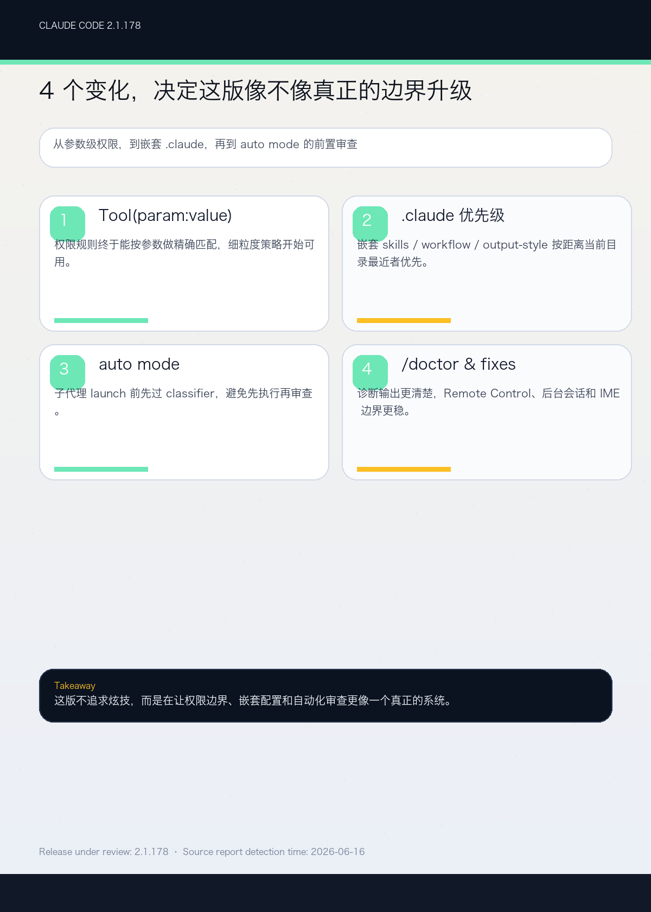

# Claude Code 2.1.178 Changelog 深度分析

> 发布日期：2026-06-16（源报告检测时间）
> 覆盖版本：2.1.178

---

## 一、TL;DR

这版最值得看 6 件事：

1. 权限规则新增 `Tool(param:value)` 语法，终于可以按工具输入参数做精确匹配，`*` 通配符也能用。
2. 嵌套 `.claude/skills` 目录会在对应目录下正常加载，同名 skill 会以 `<dir>:<name>` 并存，不再互相覆盖。
3. 嵌套 `.claude/` 的 agent、workflow 和 output-style 现在按“离当前工作目录最近”优先，项目级 workflow 保存也会写到最近的 `.claude/workflows/`。
4. auto mode 在真正启动子代理前会先走 classifier，补上了“子代理先发起、后审查”的安全缺口。
5. `/doctor` 输出更整齐，skill 截断告警会说明有多少描述被影响，`/bug` 也要求先写描述再提交。
6. 一串现实世界里的边界问题被修掉了：远程控制、OAuth/WS 残留文件、后台会话、`claude agents`、vim undo、CJK IME 等都更稳。

一句话：**2.1.178 是一版明显偏权限表达、嵌套配置解析和自动化安全边界的维护版。**

## 二、版本定位

Claude Code 2.1.178 没有追求表面上的大功能，而是继续收紧长期运行时最容易出问题的地方：

- 权限规则表达
- `.claude` 嵌套目录优先级
- auto mode 子代理审查
- 诊断和告警展示
- 远程控制与后台会话恢复

如果你把 Claude Code 接在 OpenClaw、monorepo 或无人值守自动化流程里，这版会比“普通 bugfix”更值得注意。

## 三、最重要的变化

### 3.1 权限规则开始能按参数做精确匹配

最实用的新能力是 `Tool(param:value)` 语法。

以前很多权限规则只能按工具名粗粒度控制，现在可以直接把输入参数纳入匹配条件，比如：

```text
Agent(model:opus)
```

这意味着你不必再对整个工具“一刀切”，而是可以针对特定模型、特定参数或带通配符的组合做限制。对需要控制子代理模型、外部连接目标或高风险操作的团队来说，这种表达方式更像真正的策略语言。

### 3.2 嵌套 `.claude/skills` 和 `.claude/` 的优先级更符合直觉

这一版把目录局部性讲清楚了。

当你在某个子目录里工作时，那个子目录下的 `.claude/skills` 也会被加载；如果同名 skill 冲突，嵌套版本会以 `<dir>:<name>` 出现，让根级 skill 和局部 skill 同时可用。

同样的逻辑也扩展到了 `.claude/` 里的 agent、workflow 和 output-style：离当前工作目录最近的配置优先。项目级 workflow 保存也会写进最近存在的 `.claude/workflows/`。

这对 monorepo 特别重要。以前你很容易搞不清到底命中了哪层配置；现在层级关系更像文件系统本身，而不是一团隐式魔法。

### 3.3 auto mode 的安全边界更早介入

以前最容易担心的一点是：子代理已经要起了，才发现它想做的动作不该放行。

2.1.178 把这道门往前挪了。auto mode 现在会在子代理 launch 之前先经过 classifier 评估，补上了一个安全空档。这个改动的核心不是“更严格”三个字，而是“审查发生得更早”。

对无人值守工作流来说，这种前置检查很关键。它减少了“先执行、再解释”的机会，也让策略更接近真正的风险控制。

### 3.4 诊断和可见性终于更像工具该有的样子

这一版把很多小而烦的可见性问题一起修了：

- `/doctor` 现在是更一致的扁平树布局
- section 状态图标更清晰
- command name 更醒目
- skill 列表截断提示会告诉你有多少 description 被影响
- workflow prompt keyword 变成紫色 shimmer，而且只在明确短语上触发
- `/bug` 需要先写描述，不再把 model-refusal 文本当 issue title

这些改动看起来碎，但它们在一起会显著降低“我看到的东西和系统真实状态不一致”的概率。

### 3.5 远程控制、后台会话和真实边界问题继续补洞

这版的修复名单很长，但都挺“生产环境”：

- Remote Control 错误信息更具体，连接失败会有持续的红色 `/rc failed` 指示
- “未启用”类错误会说明到底是 gate、check failure、stale entitlement 还是 org policy
- stale websocket / OAuth 文件句柄导致的崩溃被修掉了
- Claude in Chrome 遇到不同账号 token 时不会静默失败
- `claude agents` worker 的 401 bearer token 问题被修复
- `/bg` 或 `←←` 创建的后台会话不再卡在 “Working”
- 继承错误 env 的 model request 不会继续拿旧配置失败
- vim mode 的 `u` 终于按一步一步 undo，而不是把连续命令揉成一坨
- CJK IME 的 Esc 退出不会误伤正在运行的任务

这些不是“炫技修复”，但它们决定了这个 CLI 在复杂环境里到底像不像生产工具。

## 四、我怎么看这次升级

如果你只是偶尔跑一下 Claude Code，这版不会让你兴奋。

但如果你有下面这些使用方式，2.1.178 就很值得跟：

- 要按参数精确控制权限
- 依赖嵌套 `.claude` 做局部工作流
- 运行 auto mode 或子代理自动化
- 需要稳定的 `/doctor`、`/bug` 和 skill 可见性
- 在远程控制、后台会话、tmux/SSH 或混合平台里工作

这次升级最重要的信号不是“加了什么”，而是“边界开始更像边界了”。

## 五、升级前后建议

升级前：

- 检查你是否在权限规则里依赖粗粒度工具名
- 确认子目录里的 `.claude/skills` 和 `.claude/workflows` 有没有同名冲突
- 看看 auto mode 的审查链路有没有被你当成“默认会放行”

升级后：

- 在关键目录跑一次 `/doctor`
- 验证 `Agent(model:opus)` 这类参数级规则是否按预期生效
- 测一下嵌套 skill 和 workflow 的命中顺序
- 让一个子代理走完整个审查路径，确认 classifier 的拦截时机

## 六、结论

Claude Code 2.1.178 不是一版会让人立刻喊“新功能来了”的版本，但它很像一版真正面向生产的维护升级。

它把最容易出问题的几个层面都往前推了一步：

- 权限规则更细
- 嵌套配置更可预期
- auto mode 更安全
- 诊断输出更清楚
- 远程控制和后台会话更少出意外

如果你已经把 Claude Code 纳入日常工作流，这版值得尽快跟上。
