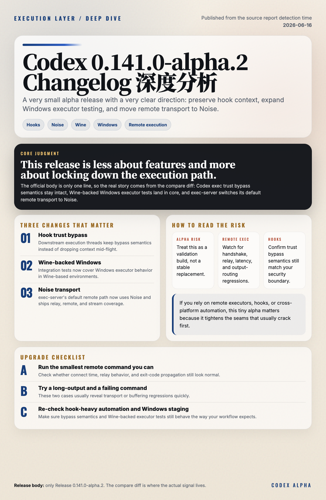

# Codex 0.141.0-alpha.2 Changelog 深度分析

> 发布日期：2026-06-16（源报告检测时间）
> 覆盖版本：0.141.0-alpha.2

---

## 一、TL;DR

这版最值得看 4 件事：

1. `codex exec` 线程里的 hook trust bypass 语义被保留下来，后续派生执行线程不会把上下文弄丢。
2. core 集成测试开始覆盖 Wine-backed 的 Windows executor，说明 Windows 远程执行链路还在补回归。
3. exec-server 的默认远程传输切到 Noise，并补了 relay、remote 和 stream 相关测试。
4. 这次 release body 只有一句 `Release 0.141.0-alpha.2`，它更像一次执行链路和测试基础设施的快速校准，而不是面向普通 CLI 用户的新功能发布。

一句话：**0.141.0-alpha.2 是一版很小但很有方向感的 alpha 补丁。**

## 二、版本定位

这次 release 的官方正文非常短，几乎没有手写 changelog。真正的信息主要来自 compare 结果和相关提交。

从结果看，这不是一个面向终端用户的大版本，而是一次把底层执行链路、跨平台测试和远程传输语义一起校准的维护更新：

- `codex exec` 的 hook trust bypass 语义更一致
- Windows executor 的集成测试覆盖更完整
- exec-server 的远程通道默认切到了 Noise

如果你只是本地交互式使用 Codex，可能感知不强。但如果你在用远程 executor、自动化线程、hooks 或跨平台执行，这类改动会直接影响稳定性。

## 三、最重要的几处变化

### 3.1 `codex exec` 线程保留 hook trust bypass 语义

提交 `d007b08`，PR `#26434`。

这个变更的重点是：当一个 `codex exec` 线程已经处在允许绕过 hook 信任检查的上下文里时，后续派生的执行线程也要保留这一语义，而不是在中途把信任状态丢掉。

它看起来不像新功能，但对自动化非常关键：

- 主线程和子线程的行为更一致
- 依赖 hooks 的脚本不容易出现“这层放行、下一层又拦住”的抖动
- 自动化、cron、agent 执行链路更像一个连续上下文，而不是多段拼接

对用户而言，这主要提升的是执行一致性，而不是增加一个新的开关。

### 3.2 Wine-backed Windows executor 的集成测试开始补齐

提交 `1fe89de`，PR `#28401`。

这部分变化集中在：

- `bazel/rules/testing/wine/*`
- `codex-rs/core/tests/remote_env_windows/*`
- `codex-rs/exec-server/testing/wine_remote_test_runner.rs`
- core test environment helper

它的意义不是“Windows 用户今天立刻多了一个新按钮”，而是 Windows 远程执行链路终于继续往可验证、可回归的方向补基础设施。

换句话说，这版更像是在告诉你：

- Windows executor 这条路还在认真维护
- Wine-backed 运行环境正在被纳入正式测试面
- 远程执行在跨平台场景下的稳定性会更可控

如果你依赖 Windows 或 Wine-like 测试环境，这类回归覆盖会直接影响后续版本的可信度。

### 3.3 exec-server 默认远程传输切到 Noise

提交 `6e50b22`，PR `#26245`。

这是本次 alpha 里最值得注意的底层变化。相关改动覆盖：

- `codex-rs/exec-server/src/relay.rs`
- `codex-rs/exec-server/src/remote.rs`
- `codex-rs/exec-server/src/noise_channel.rs`
- 新增 `noise_relay/executor_stream.rs`
- relay / remote / Noise 相关测试

这里的关键不是“Noise 这个词听起来更酷”，而是 exec-server 的远程传输默认路径发生了变化。它意味着远程执行通道在安全握手和传输语义上更明确，也更依赖这一套新路径的稳定性。

对 agent 用户来说，最需要关注的是：

- 连接建立是否更稳
- relay / remote 握手有没有新的失败模式
- stdout / stderr / 退出码传递是否仍然一致
- 旧配置是否还会被正确识别

这是一种底层协议级的变化，不是 UI 层面的调整。

## 四、风险和影响

### Alpha 风险

这是 prerelease alpha，而且 release body 没有展开说明。它应该被当作“验证版本”，而不是稳定版替代品。

### 远程执行兼容性风险

如果你依赖 remote executor、app-server、远程 shell 或跨机器 agent 执行，Noise 默认切换后需要重点观察：

- 连接是否失败或变慢
- 是否出现 handshake / relay / remote transport 相关错误
- 旧配置是否还会按预期生效

### Hooks 行为一致性

hook trust bypass 语义被保留，通常是为了修复执行一致性问题。但如果你的项目把 hooks 当安全边界，就要重新确认 bypass 上下文没有被误用。

## 五、我怎么看这次升级

这次 release 很小，但方向很清楚。

它没有追求显眼的新命令，也没有在 release body 里堆一大段用户可见特性，而是在做三件很实际的事：

- 让 `codex exec` 的 hook 语义更一致
- 让 Windows executor 的测试覆盖更靠谱
- 让 exec-server 的远程传输默认路径更明确

这类更新最大的价值，不是“新鲜”，而是“减少未来踩坑”。

## 六、升级建议

1. 如果你在测试 `0.141.0` alpha 系列，可以优先跟进这一版。
2. 如果你依赖远程 executor，先跑最小命令、长输出命令和失败退出码命令。
3. 如果你的自动化流程里有 hooks，重点确认 trust bypass 语义是否符合预期。
4. 如果你还要跑 Windows 或 Wine-backed 测试环境，建议先在 staging 验证一次。

## 七、结论

Codex 0.141.0-alpha.2 不是一版热闹的 release，但它把执行链路里最关键的几处边界继续收紧了：

- hooks 更一致
- Windows executor 测试更完整
- exec-server 远程传输更明确

如果你关心的是 Codex 的执行稳定性、远程链路和跨平台验证，这版值得记录。
