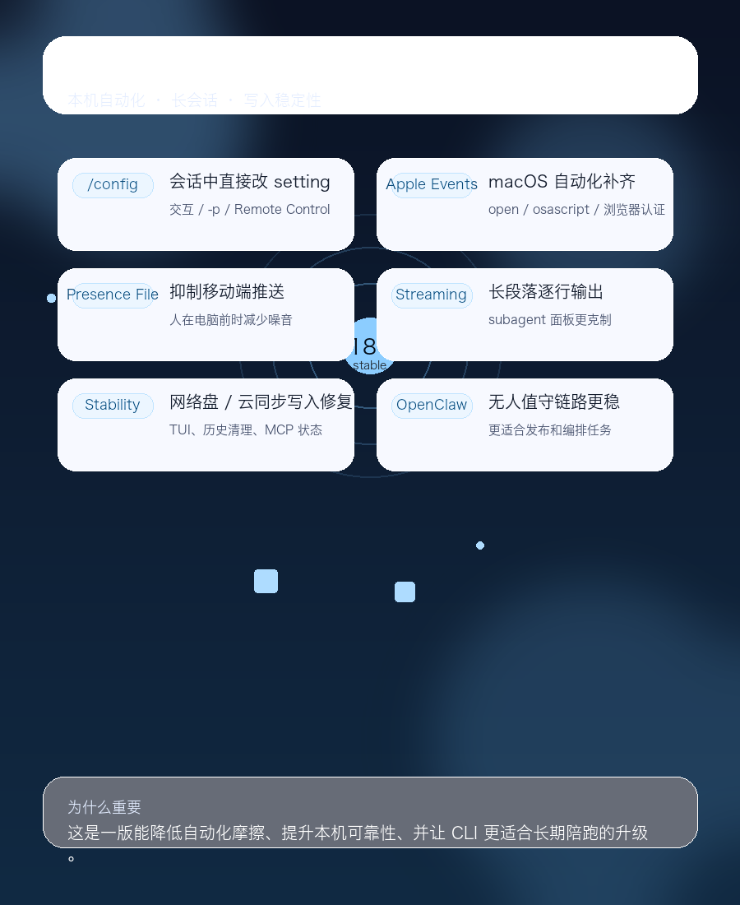

# Claude Code 2.1.181：配置入口、macOS 自动化和子代理面板一起升级

> 发布日期：2026-06-18  
> 版本：`2.1.181`  
> 来源：Claude Code 官方 `CHANGELOG.md`

## 一、TL;DR

这版最值得看的 6 件事：

1. 新增 `/config key=value`，可以在交互式会话、`-p` 和 Remote Control 里直接改任意 setting，临时调参更轻。
2. 新增 `sandbox.allowAppleEvents` opt-in，修复 `open`、`osascript` 和浏览器认证流程里的 macOS Apple Events error -600。
3. 新增 `CLAUDE_CLIENT_PRESENCE_FILE`，可以在你本人就在机器前时压制移动端推送，减少多端通知噪音。
4. 内置 Bun 升到 1.4，长段落 streaming 改成逐行出现，体感上更像“边想边吐字”。
5. subagent 面板更克制了：30 秒无操作自动隐藏，最多显示 5 行，并提供滚动提示。
6. 一组稳定性修复集中补在 prompt caching、网络盘写文件、启动卡顿、配置损坏、长会话清理、MCP 状态和 AWS 凭证刷新上。

一句话：**2.1.181 不是功能爆炸版，而是把临时配置、本机自动化和长会话体验一起修顺的一版。**

## 二、这版到底在修什么

如果把 2.1.181 的 changelog 压缩成一个主题，那就是：**让 Claude Code 更容易“当场改”，也更少在 macOS 和长会话里翻车。**

这版没有引入一个特别显眼的新主命令，但它碰到的都是高频真实场景：

- 临时改配置
- macOS 自动化和浏览器认证
- 多端通知噪音
- 长段落输出体验
- subagent 面板的可读性
- 网络盘、云同步目录和长会话稳定性

这类更新通常不喧哗，但会直接影响你每天愿不愿意继续用。

## 三、最重要的几处变化

### 3.1 `/config key=value`：临时改 setting 终于不用绕远路

这次最直接的新入口就是：

```text
/config thinking=false
```

它可以在这些场景生效：

- 交互式会话
- `-p`
- Remote Control

这个变化的意义很大。以前你想临时改一个 setting，往往要去翻配置文件、改 wrapper、或者换一条启动命令。现在可以直接在会话里改，试验成本低很多。

更重要的是，它让一些临时决策更贴近上下文，例如：

- 某个任务临时关掉 thinking
- 某次执行临时调整 sandbox
- 某个团队约定在会话里临时覆盖

对重度用户来说，这会比“又加了一个按钮”更有用。

### 3.2 `sandbox.allowAppleEvents`：macOS 自动化终于补齐

这版新增了 `sandbox.allowAppleEvents` opt-in。

它的直接收益是：`open`、`osascript` 和浏览器认证流程在 macOS 上不再轻易撞上 Apple Events error -600。

如果你依赖这些工作流，典型场景会是：

- 打开系统浏览器做 OAuth
- 用 AppleScript 做本机自动化
- 让 sandboxed command 跟 macOS 应用交互

这次修复说明 Claude Code 在 macOS 本机工作流上的支持继续补得更完整了，但它仍然保持了 opt-in 的边界。也就是说，能力变强了，但默认安全边界没有被粗暴打穿。

### 3.3 `CLAUDE_CLIENT_PRESENCE_FILE`：把“人在机器前”这件事告诉客户端

新环境变量 `CLAUDE_CLIENT_PRESENCE_FILE` 是一个很典型的“看起来小，实际很顺手”的改动。

你可以把它指向一个 marker file，用来在你本人已经坐在电脑前时，抑制移动端推送通知。

这个设计很适合长时间跑 agent 的人：

- 桌面上已经在工作时，不想手机又来一轮提醒
- 远程和本地双端同时登录时，想减少噪音
- 希望通知更像“真的需要我”，而不是“又响了一次”

它本质上是一个很实用的 presence signal。

### 3.4 Bun 1.4、逐行 streaming 和 subagent 面板：体感优化集中落地

这版还做了三件很影响日常手感的更新：

1. 内置 Bun 升级到 1.4
2. 长段落输出改成逐行 streaming
3. subagent 面板更克制，空闲 30 秒自动隐藏，列表最多 5 行并给滚动提示

这三项看起来不算“新功能”，但它们会明显改变你对工具是否顺手的判断。

特别是 subagent 面板这个改动很务实：如果你同时跑多个子代理，屏幕上最怕的不是信息少，而是信息太吵。现在面板会更安静，也更像一个临时控制台，而不是一直霸屏。

### 3.5 稳定性修复：把常见坑位补了一轮

这版的稳定性修复比较集中，值得单独记一下：

- prompt caching 在 `ANTHROPIC_BASE_URL` 和 Foundry 场景下的读取问题
- Write/Edit 在网络盘和云同步目录里写出 0-byte 或截断文件的问题
- 启动卡顿和慢网络下的空白等待
- `.claude.json` 损坏时的启动崩溃
- Spotlight 忙时 macOS TUI 在 session start 冻住的问题
- 长时间 idle session 被别的进程清理历史的问题
- foreground subagent 的嵌套链失控问题
- AWS 凭证过期刷新过频的问题
- `claude mcp get/list` 对 tools/list 失败状态展示不准的问题

这类修复对个人用户来说可能不显山露水，但对自动化、长会话和无人值守场景非常关键。

## 四、你可能会实际感受到的变化

### 4.1 全屏模式打开 URL 的手感变了

现在全屏模式打开 URL 需要：

- macOS：`Cmd + click`
- 其他终端：`Ctrl + click`

这更接近原生终端行为。习惯直接点链接的人需要改一下肌肉记忆。

### 4.2 `Improved N memories` 默认不再列出单个文件

这会让普通 transcript 更干净，但如果你之前依赖那一行做脚本解析，就要改成 verbose mode 或其他来源。

### 4.3 API 断连中途会自动 retry

如果连接在 thinking 过程中断了，Claude Code 不会直接停在 “Connection closed while thinking”，而是自动重试。

好处是失败感少了，坏处是排查网络问题时要更注意 retry 指示。

### 4.4 `claude mcp get/list` 的状态语义更诚实

以前 tools/list 失败时，界面可能还写着连上了。现在会更明确地显示 `tools fetch failed`。

这对排障很有帮助，因为“连上了但其实失败了”是最浪费时间的一类假象。

## 五、风险与建议

1. `/config` 让会话内临时改 setting 更容易了，团队最好明确哪些项可以覆盖，尤其是 `sandbox`、`thinking`、`model` 这类影响安全和成本的选项。
2. `sandbox.allowAppleEvents` 是 opt-in，但一旦打开就会扩大沙箱命令的系统交互能力，建议按最小权限原则使用。
3. `CLAUDE_CLIENT_PRESENCE_FILE` 很适合减少通知噪音，但也意味着你需要想清楚“人在机器前”和“远程离开”的边界。
4. 如果你的自动化脚本依赖旧的 URL 点击、`Improved N memories` 文案或 `claude mcp get/list` 输出，要先做一次 smoke test。

## 六、结论

Claude Code 2.1.181 更像一次“把日常使用磨顺”的升级。

它最重要的不是某个大功能，而是把三件事同时补强了：

- 临时调参更直接
- macOS 自动化更完整
- 长会话和多 subagent 体验更安静、更稳定

如果你关心的是“新增了多少功能”，这版看起来不算热闹。

如果你关心的是“每天用起来会不会少踩坑”，这版很值得升级。
