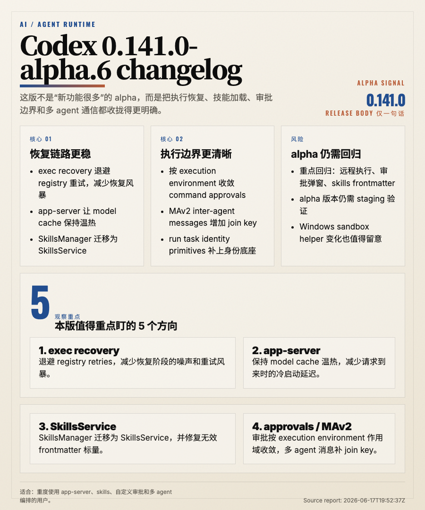

# Codex 0.141.0-alpha.6 Changelog 深度分析

> 发布日期：2026-06-18
> 覆盖版本：0.141.0-alpha.6

---

## 一、TL;DR

这版最值得看 5 件事：

1. exec recovery 的 registry retries 开始退避，恢复阶段不再那么容易刷屏。
2. app-server 主动把 model cache 保温，长驻服务和远程场景的冷启动延迟更有机会下降。
3. SkillsManager 被 SkillsService 取代，同时修复了无效 skill frontmatter 标量。
4. command approvals 开始按 execution environment 作用域收敛，权限边界更细了。
5. MAv2 inter-agent messages 加上 join key，run task identity primitives 也开始补齐。

一句话：**0.141.0-alpha.6 更像一次 runtime、权限边界和协作协议的整理，而不是面向普通 CLI 用户的显性功能版本。**

## 二、版本定位

官方 release body 只有一句 `Release 0.141.0-alpha.6`，说明这次 alpha 的主信息不在手写说明里，而在 compare 结果和具体提交里。

从这些提交看，它不是一个给终端用户“发新功能”的版本，而是把下面几条基础链路往更稳的方向推：

- exec recovery 不再高频重试 registry
- app-server 更积极维护模型缓存
- skills 加载从 manager 迁到 service
- approvals 不再粗暴共享到所有执行环境
- multi-agent 消息和任务身份开始更像一套完整协议

如果你只是本地跑一次短命令，可能感知不强。但如果你在用 app-server、skills、自定义审批、多 agent 编排或远程执行，这版会直接影响稳定性和调试体验。

## 三、最重要的几处变化

### 3.1 exec recovery 的重试开始退避

提交 `Back off registry retries during exec recovery (#28546)` 是这版最明显的稳定性改动之一。

它的核心不是“更快恢复”，而是“别在恢复时制造更多恢复问题”：

- registry 短暂不可用时，不会立刻高频重试
- 恢复链路的日志噪声会更可控
- 长任务、cron、自动化 agent 的故障感知更像正常退避，而不是重试风暴

这类变化通常很低调，但对稳定性很关键。

### 3.2 app-server 主动保温 model cache

`app-server: keep the model cache warm (#28699)` 说明 app-server 开始更主动地维护模型缓存，而不是每次请求进来才临时刷新。

这对长驻服务和远程控制场景的影响很实际：

- 模型列表或能力信息更可能提前就绪
- 首次打开模型选择、配置读取时的延迟可能降低
- 部署侧需要留意后台刷新带来的失败日志或限流行为

对做 app-server 客户端的人来说，这一条值得回归一次刷新时序和缓存失效行为。

### 3.3 SkillsManager 迁移为 SkillsService

`Replace SkillsManager with SkillsService (#28705)` 是技能系统里很重要的一次内部重构。

它通常意味着：

- 技能加载链路更服务化
- manager 语义被 service 语义替代
- 相关的测试、loader 和错误提示会被重新整理

同时这版还修复了 `invalid skill frontmatter scalars`，说明技能 frontmatter 的容错性在同步补强。

如果你依赖自定义 skills，最值得检查的是：

- skills 是否还能正常发现
- frontmatter 里有无非标量字段
- 错误提示是否比以前更清楚

### 3.4 command approvals 按 execution environment 收敛

`Scope command approvals by execution environment (#28738)` 是这版对权限边界影响最大的变化之一。

它的含义很直接：同一个 Codex 会话里的审批，不应该在不同 execution environment 之间无差别复用。

影响会体现在：

- 本地、远程、sandbox、app environment 的审批边界更清晰
- 自动化脚本可能要接受更多“按环境重新批准”的情况
- 用户能更清楚地知道自己批准的是哪一个执行上下文

这是安全性上的进步，但对旧自动化流程可能意味着要重新适配。

### 3.5 multi-agent 消息和任务身份开始补齐

`Add join key for MAv2 inter-agent messages (#28561)` 和 `feat: add run task identity primitives (#19047)` 放在一起看，信号很明确：Codex 正在把多 agent 协作从“能跑”往“可归因、可关联、可审计”推进。

这些基础能力的价值在于：

- 更容易把父子 agent、线程和任务关联起来
- 日志归因和问题排查更容易
- 协作协议更接近稳定基建，而不是临时拼装

如果你有自己的 agent orchestration 工具，这一块值得重点关注协议字段和消息 envelope 的变化。

## 四、风险和影响

### 4.1 alpha 风险仍然存在

这是 prerelease alpha，不是稳定版。官方正文又极短，所以它更像验证版本，而不是生产环境的最终替代。

### 4.2 审批弹窗和自动化可能会变多

按 execution environment 收敛审批后，旧的“批准一次，处处通用”流程可能不再成立。

### 4.3 skills 前后兼容边界要回归

SkillsService 重构和 frontmatter 修复一起出现，说明技能加载边界在动。自定义 skills 或自动生成 skills 的人要重点验一下。

### 4.4 远程执行和 app-server 需要观察

model cache 保温、exec recovery 退避、multi-agent join key、run task identity 这些变化都偏底层，建议在 staging 先跑一轮完整链路。

## 五、我怎么看这次升级

这版没有追求“立刻能展示给用户看的大功能”，但它做的几件事都很关键：

- 让恢复链路更安静
- 让 app-server 更像常驻服务
- 让 skills 更像服务而不是杂糅的管理器
- 让审批更精确
- 让多 agent 的消息和身份更可追踪

这类 release 的价值不在热闹，而在把以后更难排查的坑提前填掉。

## 六、升级建议

1. 如果你在跟踪 `0.141.0` alpha 线，这版值得优先验证。
2. 如果你依赖 app-server，先跑模型列表、配置读取和一次刷新流程。
3. 如果你用了 skills，自查 frontmatter 和加载错误。
4. 如果你在做自动化审批，确认 execution environment 维度是否已经进入你的策略。
5. 如果你有多 agent 编排，观察 join key 和 task identity 是否进入日志链路。

## 七、结论

Codex 0.141.0-alpha.6 是一版很典型的“底层整理”型 alpha。

它不炫，但很有方向感：

- exec recovery 更稳
- app-server 更热
- skills 更服务化
- approvals 更细
- multi-agent 更可关联

如果你关心的是 Codex 的执行稳定性、权限边界和协作协议，这版值得记录。
