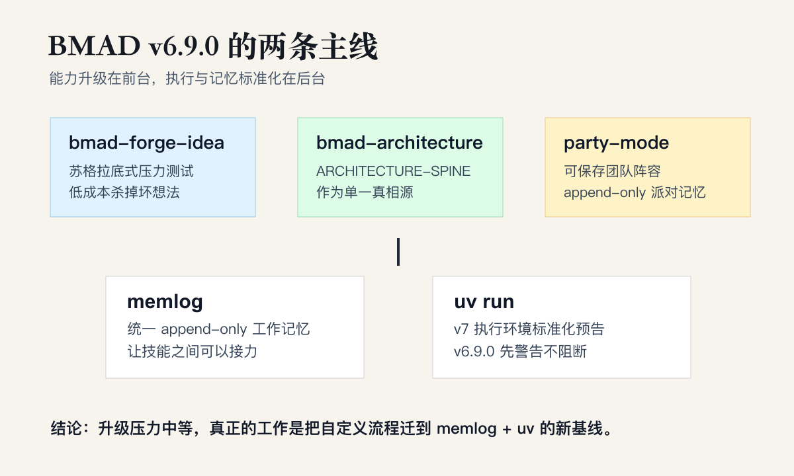

# BMAD METHOD v6.9.0：推理技能锐化，编排获得记忆

> 发布时间：2026-06-22 05:15 UTC  
> Release URL：<https://github.com/bmad-code-org/BMAD-METHOD/releases/tag/v6.9.0>  
> 类型：正式发布，非 prerelease

BMAD METHOD v6.9.0 是一次很典型的“双线升级”：前台增加了更强的推理与协作技能，后台则把执行环境和跨技能记忆继续标准化。

如果只记一个判断，就是：

**v6.9.0 的主题不是“多几个命令”，而是让 BMAD 的分析、架构、协作和记忆开始更像一个系统。**

这次最值得关注的变化有五个：

1. `bmad-forge-idea` 进入 core，用苏格拉底式追问和对抗攻击来压力测试早期想法。
2. `bmad-architecture` 完成脊柱式重写，把 `ARCHITECTURE-SPINE.md` 提升为架构真相源。
3. `party-mode` 重生为可保存、可定制、可带记忆的协作团队。
4. 共享 `memlog` 成为跨 skill 工作记忆原语。
5. 安装器开始向 `uv run` 迁移，为 v7 的执行环境标准化铺路。

## 这次真正的主线

### 1. `bmad-forge-idea`：把早期想法先打一遍

`bmad-forge-idea` 是一个领域无关的创意压力测试工具，适合放在脑暴之后、正式写 spec 之前。

它不是帮你“润色想法”，而是主动追问：

- 这个想法解决的真问题是什么？
- 哪些前提一旦不成立，整个方案就会崩？
- 有没有更便宜的验证路径？
- 现在继续投入，是硬化想法、证明可行，还是低成本杀掉？

它的几个关键设计很清楚：

- 苏格拉底式一问一答，而不是一次性生成长文档
- 对抗攻击模式，主动找弱点和盲区
- 可选 persona room，用已安装角色组成评审团
- 结果可以留下 memlog 残留，并喂给 `bmad-spec` 或 `bmad-quick-dev`

这补上了 BMAD 分析链条里一个长期缺口：`bmad-brainstorming` 更偏发散，`bmad-spec` 更偏收敛，而 `bmad-forge-idea` 负责中间那一步“把想法拿去受力测试”。

它目前的限制也要记住：主要是交互模式，不适合无头自动化批量跑。

### 2. `bmad-architecture`：架构文档有了脊柱

这次的 `bmad-architecture` 不是简单替换旧名 `bmad-create-architecture`。真正的变化是方法论重写。

新版把 `ARCHITECTURE-SPINE.md` 作为单一真相源，`SPEC.md` 从脊柱派生。这个设计解决的是旧流程里很常见的问题：多个架构文档各自讲一段，时间一久就开始互相漂移。

几个变化尤其重要：

- 5 种入口自动识别：原始想法、大文档、代码库、功能切片、已有脊柱
- 脊柱作为权威来源，减少多文档同步成本
- 广度覆盖评分卡，用 decided / deferred / open 标注每个维度
- 可选评审门，审查严格度可以按场景缩放
- 完整无头模式，适合自动化流程
- `lint_spine.py` 加固，包含 fence blanking、鲁棒列检测和回归测试

这说明 BMAD 在往“架构产物可验证”走，而不是只追求“架构文档看起来完整”。

我觉得这里最有价值的不是名字变短了，而是评分卡和脊柱真相源这两个约束。前者防止遗漏，后者防止漂移。

### 3. `party-mode`：从角色扮演变成可复用团队

新版 party-mode 的变化也很实在：它不再只是一次性的角色群聊，而是可以保存、恢复、复用的协作框架。

它支持：

- 自定义 `party_members`
- 命名 `party_groups`
- auto / session / subagent / agent-team 四种运行模式
- 预装 Code Review Crew
- 每个 party 在 `{memory_dir}/<party_id>/` 下维护 append-only 会话记忆

这意味着你可以建立一个固定的代码审查团队、架构评审团队或产品挑战团队，下次再用时带着之前积累的上下文回来。

对 agent workflow 来说，这比“叫几个 persona 出来发言”更进一步：团队开始有身份、有场景、有记忆。

## 后台基础设施：memlog 和 uv

### `memlog`：共享工作记忆成为平台原语

`src/scripts/memlog.py` 是这次最值得重视的基础设施变更之一。

它提供 append-only 时序工作记忆，支持 init / append / set，并且可以被多个 skill 共享。换句话说，BMAD 不再鼓励每个 skill 自己发明一套决策日志格式，而是开始把“工作记忆”收成平台级能力。

这件事短期看只是工具统一，长期看更重要：

- skill 之间可以用一致的格式传递上下文
- 后续审计和回放会更容易
- party-mode、brainstorming、forge-idea、architecture 这些流程可以留下更连贯的轨迹

BMAD 过去更像一组强 skill 的集合。memlog 出现之后，它更像一个可以跨 skill 接力的编排系统。

### `uv run`：v7 前的迁移预告

v6.9.0 还把安装器向 `uv` 标准化推进了一步。

当前状态是：

- 安装器会检查 `uv`
- 缺失时警告，但不阻断
- 文档和安装提示开始把 `uv run` 作为标准路径
- v7 预计会全面标准化 `uv run`，不再直接依赖 `python3`

这不是立刻爆炸的 breaking change，但它是一个明确的迁移信号。已经写了自定义 skill、override、脚本的人，应该开始查一下有没有 hardcode `python3`。

建议现在就做两件事：

1. 给环境装上 `uv`
2. 把自定义 BMAD 流程里直接调用 `python3` 的地方列出来，准备改成 `uv run`

## 其他值得注意的变化

### `bmad-brainstorming` 继续增强

brainstorming 现在有三种模式：

- Facilitator
- Creative Partner
- Ideate for me

同时它也开始写 memlog，并附带一个自包含的 `brain-selector.html` 可视化技术选择器。技术库扩到 108 个，新增 HMW、JTBD、Empathy Map、Backcasting、TRIZ、Fishbone、Build on What Works、Scenario Cross 等方法。

这让 brainstorming 不再只是“生成一批点子”，而是更接近一套可追踪、可选择、可收敛的创意方法库。

### Astro 6 安全升级

文档站相关依赖也有一次安全升级：

- Astro 5.18.1 升到 6.4.6
- Starlight 0.37.5 升到 0.40.0
- 清掉一批 XSS / SSRF 相关 Dependabot 安全公告
- esbuild、markdown-it、brace-expansion 等依赖同步更新
- 内容配置迁到 `src/content.config.ts`

对普通 BMAD 用户来说，这不是最显眼的功能变化，但对项目维护质量是好信号。

### 新平台与 sprint 改进

这版还新增了 hermes-agent 和 CodeWhale 支持。CodeWhale 使用 `.codewhale/skills/` 作为项目级目录，`~/.codewhale/skills/` 作为全局目录。

Sprint 方面，retrospective 步骤会把行动项追加到 `sprint-status.yaml`，并在后续验证和展示中保留开放项。这个改动不大，但很符合 BMAD 近期的方向：让流程状态更可追踪，而不是只产出一次性文档。

## Breaking changes 和迁移风险

严格说，v6.9.0 还不是强 breaking 的版本。真正需要准备的是两个 v7 预告。

### 1. v7 会全面标准化 `uv run`

这会影响所有涉及 Python 脚本执行的 skill。v6.9.0 还只是警告，但 v7 前最好完成迁移。

如果你暂时不能安装 `uv`，至少要在自己的 agent 规则里说明：遇到 `uv run` 时允许回退到 `python3`。这只是过渡方案，不建议长期依赖。

### 2. `bmad-create-architecture` 会退役

v6.9.0 中旧的 `bmad-create-architecture` 还保留为 shim，会转发到新的 `bmad-architecture`。但 v7 会移除。

如果你的自动化流程、快捷命令、文档或团队 SOP 里还写着旧名字，现在就该改。

## 升级建议

我的建议是：两周内升级，不必抢，但也别拖到 v7 前夜。

升级后重点做这些检查：

1. 安装并验证 `uv`
2. 搜索自定义 skill 和脚本里的 `python3`
3. 把 `bmad-create-architecture` 引用改成 `bmad-architecture`
4. 试用 `bmad-forge-idea`，把它放到 spec 之前
5. 如果你经常做 code review 或架构评审，配置一个固定 party
6. 观察 memlog 输出位置，把它纳入团队的调试和复盘习惯

总体风险我会评为中等：不是因为 v6.9.0 本身危险，而是因为它已经在明确铺 v7 的路。

## 和 v6.8.0 的关系

v6.8.0 的主线是“规划契约再收口”：`bmad-ux`、`bmad-spec` 和 Web Bundles 把上游规划输出变得更可交接。

v6.9.0 则把重心往下推进了一层：

- 想法阶段有 `bmad-forge-idea`
- 架构阶段有 spine
- 协作阶段有 party memory
- 跨 skill 有 memlog
- 执行环境开始向 uv 标准化

所以这不是一版孤立更新，而是延续了 BMAD 从“技能集合”到“规划和编排系统”的演化。

## 一句话结尾

**BMAD METHOD v6.9.0 的表层变化是新增 skill 和重写架构流程，底层变化是记忆与执行环境开始统一；真正的升级动作，不只是装新版，而是把自己的工作流迁到 memlog + uv 这条新基线上。**
