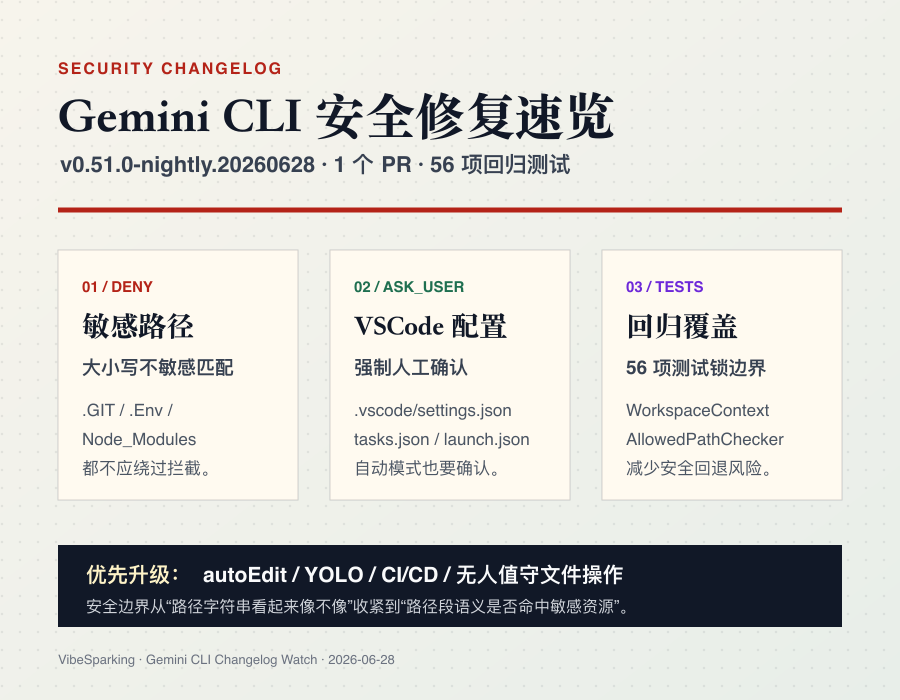

# Gemini CLI v0.51.0-nightly.20260628：自动化模式的敏感路径安全修复

> 发布日期：2026-06-28 09:45，北京时间  
> 版本标签：`v0.51.0-nightly.20260628.gae0a3aa7b`  
> 上一版本：`v0.51.0-nightly.20260626.gb14416447`  
> 变更规模：1 个 PR，56 项回归测试

Gemini CLI `v0.51.0-nightly.20260628` 是一个很小、但很值得自动化用户认真对待的 nightly。

它只包含一个 PR，核心是安全加固：修复敏感路径拦截的大小写绕过，并把 `.vscode/` 目录内的文件操作强制降级为人工确认。

如果只看一句话结论：

**只要你在 `autoEdit`、`YOLO`、CI/CD 或其他无人值守场景里使用 Gemini CLI，这版就值得尽快纳入升级验证。**

## 这次修了什么

本次核心变更来自 PR #27966：`fix(security): enforce case-insensitive sensitive path blocklist and vscode hitl`。

涉及的主要文件包括：

- `packages/core/src/utils/workspaceContext.ts`
- `packages/core/src/safety/built-in.ts`
- `workspaceContext.test.ts` 和 `built-in.test.ts`

从用户角度看，这不是功能发布，而是一次权限边界修复。

## 1. 敏感路径拦截改成大小写不敏感

修复前，Gemini CLI 的敏感路径保护可能被大小写变体绕过。

比如这些路径片段：

- `.GIT`
- `.Env`
- `Node_Modules`

在大小写敏感匹配里，它们可能没有被当成 `.git`、`.env`、`node_modules` 处理。

修复后，路径会按 segment 拆分，并对敏感目录和文件做大小写不敏感匹配。也就是说，只要路径段命中 `.git`、`.env` 或 `node_modules` 的任意大小写组合，`AllowedPathChecker` 就应该返回 `SafetyCheckDecision.DENY`。

这类修复对 AI Agent CLI 很关键。因为 CLI 不只是读文本，它还能在本地文件系统里执行操作。一旦自动化模式被恶意 prompt 诱导，大小写绕过可能带来几类风险：

- 读取 `.git/config`，泄露仓库元数据或远程地址信息
- 修改 `.env`，注入或污染环境变量
- 篡改 `node_modules`，制造供应链风险

这也是为什么我会把它看成高优先级安全修复，而不是普通的小补丁。

## 2. `.vscode/` 操作强制进入人工确认

第二个变化是 `.vscode/` 目录的 HITL，也就是 Human-in-the-Loop 人工确认。

修复后，只要路径位于 `.vscode/` 目录内，检查器就会返回 `SafetyCheckDecision.ASK_USER`。这个判断同样是大小写不敏感的。

这件事的重点在于：**即使处在 `autoEdit` 或 `YOLO` 模式，也不能直接绕过这层确认。**

`.vscode/` 里常见的文件包括：

- `settings.json`
- `tasks.json`
- `launch.json`

这些文件表面上只是编辑器配置，但它们可以影响任务执行、调试入口、构建命令和项目默认行为。自动化模式如果能无确认修改这些文件，就可能把危险操作藏进开发者下一次运行任务或调试配置的路径里。

所以这次不是简单地“多弹一个确认框”，而是在自动化链路里补了一道很实用的安全闸门。

## 测试覆盖

这次 PR 新增了 56 项回归测试，覆盖两个方向：

- `WorkspaceContext.isPathWithinWorkspace()` 对大小写变体的处理
- `AllowedPathChecker` 对敏感路径拒绝和 `.vscode/` 询问策略的处理

测试数量不代表绝对安全，但至少说明这不是只改一行条件判断后裸奔发布。路径安全这类问题最怕边界样例遗漏，回归测试越具体，后续被改回去的概率越低。

## 风险判断

| 维度 | 判断 |
| --- | --- |
| 安全严重性 | 高。敏感路径大小写绕过可能影响自动化文件操作边界 |
| 向后兼容性 | 正常使用基本无影响 |
| 自动化模式影响 | 明显更安全，部分 `.vscode/` 操作会新增确认 |
| 回归风险 | 低到中。变更集中，并有 56 项测试覆盖 |
| 升级紧迫性 | 自动化用户优先升级；手动交互用户可在维护窗口升级 |

唯一需要留意的是，如果你原本依赖 Gemini CLI 在自动化模式里直接改 `.vscode/` 配置，这次升级后可能需要调整流程，让这类操作走显式确认或改成更受控的脚本。

## 升级建议

优先升级的人群：

1. 使用 `autoEdit` 或 `YOLO` 模式的用户。
2. 在 CI/CD、批处理脚本或无人值守环境中使用 Gemini CLI 的团队。
3. 允许 Gemini CLI 读取或编辑较大工作区的重度用户。

如果你只是偶尔手动使用 Gemini CLI，并且每次文件操作都会肉眼确认，这版不算紧急，但仍然建议跟进。

升级后可以做两个最小验证：

```bash
gemini --version
```

然后尝试让 Gemini CLI 在受控测试仓库里访问大小写变体路径，例如 `.GIT/config` 或 `.Env`。预期结果应该是拒绝，而不是把它当成普通路径。

如果你需要验证 `.vscode/` 行为，可以尝试修改 `.vscode/settings.json`。预期结果应该是触发用户确认。

## 结论

`v0.51.0-nightly.20260628` 不是一个热闹的版本，但它修的是 AI Agent CLI 里非常核心的边界：**自动化模式到底能不能碰敏感路径。**

这类问题平时不显眼，一旦出事就很麻烦。尤其是 Gemini CLI 这类能读写本地项目文件的工具，安全策略必须经得起 prompt 注入、大小写变体和自动化模式的共同压力。

所以这版的价值很明确：

- `.git`、`.env`、`node_modules` 的大小写绕过被封住
- `.vscode/` 配置文件操作必须人工确认
- 自动化用户获得更可靠的路径安全边界

对普通用户，它是一版安静的安全更新。对自动化用户，它是应该尽快验证并升级的版本。

*报告由 Gemini CLI Changelog Watch 生成，发布时补充了博客封面、配图与阅读结构。*
